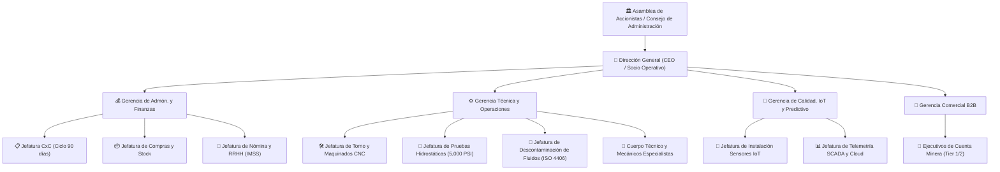

# Comercio Cuántico Internacional TR SAPI de CV
## Plan Estratégico Maestro: Mantenimiento Predictivo Hidráulico IoT (MaaS) & Estructura Organizacional

---

## 1. Resumen Ejecutivo & Tesis de Inversión

- **Razón Social:** Comercio Cuántico Internacional TR SAPI de CV.
- **Modelo de Negocio:** *Maintenance as a Service* (MaaS) y mantenimiento correctivo/remanufactura especializada para cilindros y sistemas oleohidráulicos de servicio pesado en minería.
- **Ubicación Estratégica:** Hermosillo, Sonora (con cobertura en los distritos mineros de Cananea, Nacozari, Caborca y Álamos).
- **Propuesta de Valor:** Garantizar **cero paros no programados** y disponibilidad operativa en maquinaria crítica mediante telemetría IoT no invasiva (Parker SensoNODE Gold), remanufactura bajo norma ISO y blindaje de tesorería con recompra de acciones Serie B al año 5.

---

## 2. Estructura Organizacional y Organigrama Maestro

La empresa se estructura en torno a una **Dirección General (Socio Operativo)** que rinde cuentas a la Asamblea de Accionistas / Consejo de Administración y coordina **4 Gerencias Estratégicas**:



### Descripción y Validación de Puestos Clave

1. **Dirección General (CEO / Socio Operativo):**
   - Lidera la visión estratégica, rinde cuentas al Consejo de Administración (inversionistas Serie A y B), y negocia contratos marco plurianuales con consorcios mineros (Grupo México, Fresnillo, Peñoles, First Majestic).
2. **Gerencia de Administración y Finanzas:**
   - Supervisa el flujo de caja, la cobranza estricta a corporativos (ciclo promedio de 90 a 120 días), gestión de tesorería colateralizada ($7,000,000 MXN en instrumentos líquidos con rendimiento del 6.5% neto anual) y cumplimiento laboral/fiscal ante el IMSS e ISR.
3. **Gerencia Técnica y de Operaciones:**
   - Controla el taller central de remanufactura en Hermosillo: tornos de 6 metros, fresadoras, banco de pruebas hidrostáticas a 5,000 PSI y área limpia de descontaminación de fluidos bajo norma ISO 4406.
4. **Gerencia de Calidad, IoT y Predictivo:**
   - Diferenciador nuclear de la empresa frente a talleres informales. Gestiona el despliegue de telemetría de campo, la configuración de la nube (Parker Voice of the Machine) y las certificaciones de calidad de remanufactura.
5. **Gerencia Comercial B2B:**
   - Venta técnica consultiva a superintendentes de mantenimiento y directores de mina, estructurando contratos MaaS con acuerdos de nivel de servicio (SLA).

---

## 3. Arquitectura Técnica de Mantenimiento Predictivo (Hardware Parker Hannifin)

Para operar en condiciones de minería severa, los equipos cuentan con protección industrial **IP67** y resistencia a presiones de hasta **600 bar (8,700 PSI)**.

```
       [ PISTÓN MINERO EN CAMPO ]
       ┌───────────────────────────────┐
       │ 🔴 Sensor Presión Avance      │ ──(Bluetooth / Inalámbrico)──┐
       │ 🔵 Sensor Presión Retorno     │ ──(Bluetooth / Inalámbrico)──┼──► [ GATEWAY INDUSTRIAL ]
       │ 🟡 Sensor Térmico Superficial │ ──(Bluetooth / Inalámbrico)──┘    (Parker SCOUT Edge - IP67)
       └───────────────────────────────┘                                               │
                                                                                 (4G / Wi-Fi)
                                                                                       │
                                                                                       ▼
       [ ACCIÓN MECÁNICA / REMANUFACTURA ] ◄── [ ALERTAS PREDICTIVAS ] ◄── [ NUBE PARKER VOM CLOUD ]
```

### Componentes del Kit por Cilindro / Máquina

1. **Sensores de Presión SensoNODE Gold (0-600 bar / 8,700 PSI):**
   - **Cantidad:** 2 por pistón (cámara de avance y cámara de retroceso) para evaluar presión diferencial.
   - **Alimentación:** Batería industrial de litio integrada con hasta 5 años de vida útil (sin intervención del cableado eléctrico de la máquina minera).
2. **Sensor de Temperatura Inalámbrico:**
   - Acoplamiento magnético o por rosca al cuerpo del cilindro para detectar fricción interna anormal.
3. **Gateway Industrial Receptor (SCOUT Edge):**
   - Recibe señales de hasta 100 sensores en un radio de hasta 300 metros. Transmite datos a la nube mediante Ethernet, Wi-Fi o módem celular 4G.
4. **Software en la Nube (Voice of the Machine Cloud):**
   - Dashboard centralizado con tendencias en tiempo real, umbrales de advertencia y despacho automatizado de órdenes de servicio.

### Inversión Estimada en Hardware (Por Kit)

| Componente | Especificación Técnica | Costo Unitario Estimado (USD) |
| :--- | :--- | :--- |
| **Gateway SCOUT Edge** | Concentrador receptor para hasta 100 sensores | $800 – $1,100 USD (1 por taller/planta) |
| **Sensores de Presión (x2)** | SensoNODE Gold 0-600 bar (IP67) | $800 – $1,100 USD el par ($400-$550 c/u) |
| **Sensor de Temperatura** | SensoNODE Inalámbrico | $250 – $350 USD |
| **Licencia Cloud VOM** | Monitoreo y alertas predictivas | $15 – $40 USD / mes |
| **Inversión Total de Hardware por Pistón** | **Kit Completo Instalado** | **~$1,500 – $2,300 USD** |

---

## 4. Reglas de Negocio y Criterios de Despacho Técnico

| Condición Detectada | Parámetro de Telemetría | Diagnóstico Físico | Acción Preventiva Inmediata |
| :--- | :--- | :--- | :--- |
| **Fuga Interna en Émbolo** | Caída gradual de presión en cámara de avance con carga constante. | Desgaste o fisura en sellos tipo V / bandas de desgaste; bypass de aceite. | Reemplazo programado de sellos Parker y bruñido de camisa en siguiente ventana operativa. |
| **Fricción Crítica** | Temperatura de carcasa > 60 °C sostenida. | Desalineación de vástago o cristalización de sellos de poliuretano. | Verificación de paralelismo mecánico y recambio de sellos térmicos. |
| **Fatiga por Ciclos** | Contador acumulado alcanza 500,000 carreras (*strokes*). | Fatiga por esfuerzo cíclico y micro-deformación. | Servicio general mayor programado antes de falla catastrófica. |

---

## 5. Modelo Comercial MaaS & Justificación Financiera Minera

### Estrategia de Monetización B2B

1. **Cero Fricción de Entrada:** CCI adquiere y absorbe la instalación del hardware IoT inicial.
2. **Póliza de Disponibilidad y Monitoreo ($500 USD / mes por máquina):**
   - Incluye acceso al portal de telemetría, auditoría mensual de estado de fluidos (conteo de partículas ISO) e informes de salud estructural.
3. **Contrato Exclusivo de Remanufactura:**
   - Todo servicio preventivo/correctivo derivado de las alertas se canaliza exclusivamente al taller central de CCI en Hermosillo.

### Justificación de Retorno de Inversión (ROI) para la Minera

- **Costo de Paro Imprevisto en Minería:** Entre **$10,000 y $50,000 USD por hora** en palas mecánicas, cargadores y trituradoras.
- **Costo Anual del Servicio MaaS:** $6,000 USD / año ($500 USD x 12 meses).
- **Conclusión Financiera:** Prevenir un solo evento de falla de 2 horas genera un ahorro neto de **$20,000 a $100,000 USD**, pagando la póliza de monitoreo por más de 3 años.

---

## 6. Estructura de Capital y Proyecciones Financieras (5 Años)

### Desglose de Inversión Inicial ($20,000,000 MXN)

- **CAPEX Maquinaria y Banco de Pruebas:** $10,000,000 MXN (Tornos 6m, bruñidora, banco 5,000 PSI, clean room).
- **Inventario Inicial:** $1,000,000 MXN (Kits de sellos Parker, barras cromadas, tubos bruñidos).
- **Capital de Trabajo Operativo:** $2,000,000 MXN.
- **Reserva de Tesorería Líquida:** $7,000,000 MXN (Genera 6.5% neto anual = $455,000 MXN/año; reintegro íntegro a los inversionistas Serie B en el Año 5).

### Indicadores Financieros Clave

- **Tasa Interna de Retorno (TIR):** **15.11%** (Supera el costo de capital WACC del 12%).
- **Valor Actual Neto (VAN):** **$1,836,412.50 MXN**.
- **Punto de Equilibrio:** **$641,666 MXN/mes** (~22 reparaciones estándar al mes).
- **Periodo de Recuperación (Payback):** **4.1 Años** (Con liquidación y salida pactada en Año 5).

---

## 7. Repositorio de Recursos Multimedia & Evidencia Digital

- 🎬 **Video Demostrativo del Modelo (YouTube):** [https://youtu.be/8XPcGuEXMuk?si=eP3yCg4IfxnXVR_4](https://youtu.be/8XPcGuEXMuk?si=eP3yCg4IfxnXVR_4)
- 📹 **Video Operativo de Campo (WhatsApp):** `/media/cci/WhatsApp Video 2026-08-27 at 01.06.14.mp4`
- 🎙️ **Audio Análisis 1:** `/media/cci/Blindar_el_mantenimiento_inteligente_en_minería.m4a`
- 🎙️ **Audio Análisis 2:** `/media/cci/Blindaje_financiero_del_mantenimiento_hidráulico_minero.m4a`
- 📄 **Ficha Legal y Estatutos:** `COMERCIO CUANTICO INTERNACIONAL TR SAPI DE CV.docx`
- 📑 **Dossier Ejecutivo:** `cci1.pdf`

---
*Documento consolidado para el expediente RAG y plan maestro de Comercio Cuántico Internacional TR SAPI de CV.*
