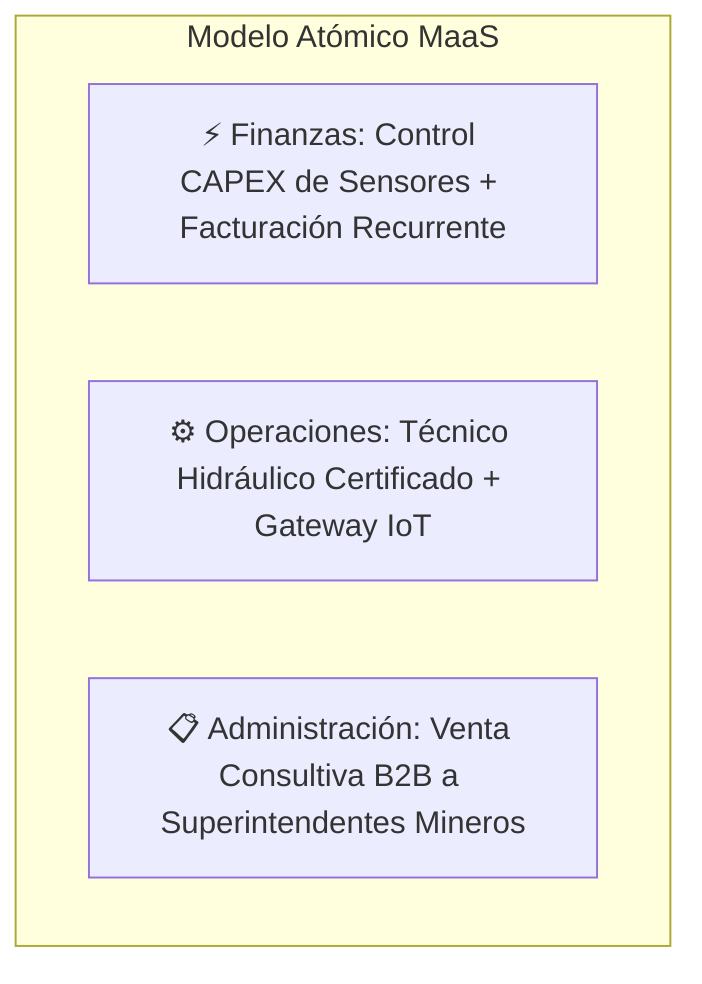

# Modelo Técnico, Operativo y Comercial: Mantenimiento Predictivo Hidráulico IoT (MaaS)

## 1. Resumen Ejecutivo y Propuesta de Valor
- **Giro:** Mantenimiento como Servicio (*Maintenance as a Service - MaaS*) y monitoreo predictivo 24/7 para sistemas hidráulicos y cilindros de servicio pesado.
- **Mercado Objetivo:** Minería a cielo abierto y subterránea, plantas de trituración, prensas industriales e inyección de plástico.
- **Propuesta de Valor:** Garantizar cero paros imprevistos y disponibilidad operativa en maquinaria crítica mediante telemetría IoT no invasiva, reduciendo costos por tiempos muertos de hasta $50,000 USD/hora.

---

## 2. Arquitectura de Hardware y Conectividad IoT (Parker Hannifin)
1. **Sensores de Presión Inalámbricos (SensoNODE Gold - Rango Minero 0-600 bar / 8,700 PSI):**
   - **Instalación:** 2 sensores por cilindro hidráulico (puerto de cámara de avance y puerto de cámara de retorno).
   - **Características:** Grado de protección industrial severa IP67, alimentación por batería de larga duración (hasta 5 años de vida útil), instalación rápida sin cableado invasivo ni perforaciones eléctricas.
2. **Sensor de Temperatura Inalámbrico:**
   - **Instalación:** Acoplado magnéticamente o por rosca directa al cuerpo del cilindro hidráulico.
   - **Función:** Monitoreo térmico continuo del aceite y fricción mecánica.
3. **Pasarela Industrial (Gateway Parker SCOUT Edge):**
   - **Capacidad:** Enlace inalámbrico local de hasta 100 sensores en radio de planta/taller.
   - **Uplink:** Conexión a internet vía Wi-Fi, Ethernet industrial o módem celular 4G/LTE para zonas remotas de mina.
4. **Plataforma Cloud (Parker Voice of the Machine Cloud):**
   - Panel de control unificado, gráficos de tendencias históricas, analítica de degradación y motor de alertas automáticas vía SMS/Email/Webhook.

---

## 3. Reglas de Negocio y Algoritmos de Diagnóstico Predictivo
El sistema dispara órdenes de servicio preventivas bajo tres criterios técnicos:

| Condición Detectada | Criterio Técnico / Lógica | Diagnóstico Mecánico | Acción Requerida |
| :--- | :--- | :--- | :--- |
| **Fuga Interna en Émbolo** | Caída gradual de presión en cámara de avance manteniendo carga constante (presión diferencial anormal). | Desgaste o fractura de sellos tipo V o bandas de desgaste del pistón; bypass de fluido hidráulico. | Reemplazo programado de sellos y rectificación de camisa en próxima ventana de paro. |
| **Fricción Crítica y Sobrecalentamiento** | Temperatura en cuerpo de cilindro > 60 °C sostenida. | Desalineación del vástago, flexión por sobrecarga mecánica o cristalización de sellos de poliuretano. | Ajuste de alineación mecánica y sustitución de empaquetaduras térmicas. |
| **Conteo de Ciclos de Vida Útil** | Registro acumulado de carreras (*strokes*) alcanzando 500,000 ciclos reglamentarios. | Fatiga natural de componentes según especificación del fabricante. | Mantenimiento preventivo integral programado con antelación. |

---

## 4. Estructura Financiera y Modelo Comercial

### A. Estructura de Costos de Hardware (Inversión por Máquina)
- **Gateway SCOUT Edge (1 por planta/zona):** $800 - $1,100 USD.
- **Sensores de Presión SensoNODE Gold (2 unidades x $400 - $550 USD):** $800 - $1,100 USD.
- **Sensor de Temperatura Inalámbrico (1 unidad):** $250 - $350 USD.
- **Licencia Cloud Voice of the Machine:** $15 - $40 USD / mes.
- **Costo Total de Hardware Estimado por Cilindro:** ~$1,500 - $2,300 USD.

### B. Esquema de Monetización (Ingresos Recurrentes + Servicios)
1. **Póliza Mensual de Telemetría y Monitoreo:**
   - Tarifa fija de **$500 USD/mes por máquina**.
   - Incluye acceso al dashboard en tiempo real, emisión de reportes mensuales de salud hidráulica y guardias de alerta 24/7.
2. **Contrato de Mantenimiento y Reparación Exclusivo:**
   - Cláusula de exclusividad para desmontaje, cambio de kits de sellos originales Parker, rectificado y pruebas hidrostáticas cuando el sistema predictivo alerte anomalías.
3. **Retorno de Inversión (ROI) para la Minera:**
   - La inversión anual en la póliza ($6,000 USD/año) se amortiza instantáneamente al evitar un solo evento de falla imprevista (cuyo costo oscila entre $10,000 y $50,000 USD/hora).

---

## 5. Metodología de Empresas Cuánticas (Fondo Thoth AC)

## 6. Recursos Multimedia y Documentación de Referencia (CCI)
- **Video Demostrativo Principal:** [Demostración IoT y Mantenimiento Minero en YouTube](https://youtu.be/8XPcGuEXMuk?si=eP3yCg4IfxnXVR_4)
- **Video Local en Planta:** `/media/cci/WhatsApp Video 2026-08-27 at 01.06.14.mp4`
- **Audios de Análisis de Negocio:**
  - `Blindaje_financiero_del_mantenimiento_hidráulico_minero.m4a`
  - `Blindar_el_mantenimiento_inteligente_en_minería.m4a`
- **Documentos Corporativos:**
  - `COMERCIO CUANTICO INTERNACIONAL TR SAPI DE CV.docx`
  - `Actividad_Individual_Fayol14_.docx`
  - `cci1.pdf` (Presentación Institucional CCI)
- **Identidad Visual y Logotipos:**
  - `/media/cci/Comercio Cuantico Internacional TR SAPI de CV Logo y Isotipo.png`
  - `/media/cci/Comercio Cuantico Logo Suite - Industrial Strength.png`

