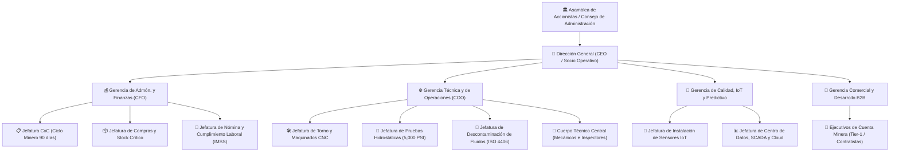

# Manual Organizacional y Perfiles de Puesto: Comercio Cuántico Internacional TR SAPI de CV

Este documento detalla la estructura corporativa, el organigrama maestro de 4 gerencias estratégicas y las fichas técnicas de perfil de puesto basadas en el plan de negocios de **Comercio Cuántico Internacional (CCI)**.

---

## 1. Organigrama Maestro y Líneas de Mando

---

## 2. Fichas Técnicas de Puestos de Alta Dirección

### 1. Director General (CEO / Socio Operativo)
- **Misión:** Liderar el crecimiento estratégico de la empresa en el clúster minero de Sonora, coordinar la alta dirección operativa y asegurar el retorno de capital de los inversionistas Serie A y Serie B.
- **Perfil Académico y Experiencia:**
  - Ingeniero Mecánico, Mecatrónico o afín con Maestría en Administración de Empresas (MBA).
  - Más de 25 años de experiencia en mantenimiento industrial hidráulico y dirección de talleres de servicio para minería y maquinaria pesada.
  - Residencia obligatoria en el estado de Sonora.
- **Reportabilidad:** Reporta directamente a la Asamblea de Accionistas y al Consejo de Administración.
- **Funciones y Responsabilidades Clave:**
  - Representar legal y estratégicamente a la Sociedad SAPI de CV ante socios, consejeros y entes reguladores.
  - Garantizar el cumplimiento del plan de negocios a 60 meses, apuntando a una TIR objetivo ≥ 15.11% y un VAN de $1,836,412 MXN.
  - Supervisar y coordinar semanalmente a las 4 Gerencias Estratégicas (Finanzas, Operaciones, Calidad/IoT y Comercial).
  - Negociar directamente los contratos marco plurianuales con corporativos mineros Tier-1 (Grupo México, Fresnillo, Peñoles).
  - Gestionar la comunicación y reportes fiduciarios trimestrales con el Fideicomiso de Inversión (Serie B sin voto), liderando la salida estructurada (*drag-along*) al cierre del Año 5.
  - Aprobar los presupuestos anuales de CAPEX ($10M MXN) y OPEX operativo.
- **Esquema de Compensación:**
  - Sueldo inicial de arranque comprimido de **$15,000 MXN/mes** (esquema de reinversión en especie de socios fundadores), escalando a una banda de **$35,000 a $45,000 MXN/mes** a partir del mes 18 conforme se estabilice el flujo de caja.

---

### 2. Director de Administración y Finanzas (CFO)
- **Misión:** Guardián de la tesorería corporativa. Administrar los recursos fiduciarios y estructurar herramientas financieras que solventen el prolongado ciclo de cobranza minero (90-120 días) sin estrangular la liquidez operativa.
- **Perfil Académico y Experiencia:**
  - Contador Público, Administrador o Financiero con Maestría en Finanzas o especialidad afín.
  - Más de 12 años de experiencia en administración financiera en empresas con facturación superior a $80M MXN anuales.
  - Experiencia sólida en estructuración de fideicomisos, Vehículos de Propósito Especial (SPV) y estrategias de tesorería (*back-to-back* y factoraje).
  - Sólido conocimiento en gestión de cobranza corporativa a 90 días.
  - Residencia en Hermosillo, Sonora.
- **Reportabilidad:** Reporta al Director General y presenta métricas financieras trimestrales al Consejo de Administración.
- **Funciones y Responsabilidades Clave:**
  - Administrar el ciclo de capital de trabajo: cuentas por cobrar a 90 días, DPO de proveedores (45-55 días), compras y nómina.
  - Gestionar y blindar el Fideicomiso de Inversión de **$20,000,000 MXN** (con reserva líquida colateralizada de $7,000,000 MXN al 6.5% neto anual).
  - Producir estados financieros mensuales y trimestrales, vigilando el punto de equilibrio ($641,666 MXN/mes) y sosteniendo un margen operativo del 60%.
  - Garantizar el cumplimiento fiscal (ISR, IVA, PTU), de seguridad social (IMSS, INFONAVIT) y normativas de prevención (UIF, PLD).
  - Habilitar líneas de factoraje y crédito revolvente para financiar las cuentas por cobrar sin interrumpir la compra de refacciones críticas.
  - Coordinar auditorías externas (Big Four) y el calendario trimestral de dividendos preferentes (split 60% inversionistas / 40% socios).

---

### 3. Director de Operaciones (COO / Gerente Técnico)
- **Misión:** Espina dorsal técnica del Taller Multiactivo de Hermosillo. Controlar los procesos de maquinado de precisión, reconstrucción de cilindros y asegurar la entrega bajo estándares internacionales.
- **Perfil Académico y Experiencia:**
  - Ingeniero Mecánico, Mecatrónico o Hidráulico.
  - De 15 a 20 años de experiencia en reconstrucción de pistones, cilindros de alta presión, grúas móviles y mantenimiento industrial minero.
  - Certificación en hidráulica de potencia.
  - Dominio y capacidad de auditoría en normas **ISO 9001** (calidad en maquinado CNC) e **ISO 4406** (control estricto de contaminación de fluidos hidráulicos).
  - Residencia en Hermosillo, Sonora.
- **Reportabilidad:** Reporta directamente al Director General.
- **Funciones y Responsabilidades Clave:**
  - Planificar y operar el taller para procesar simultáneamente hasta 12 reconstrucciones de cilindros por turno y 80 pruebas hidrostáticas mensuales.
  - Cumplir los Acuerdos de Nivel de Servicio (SLA): respuesta técnica < 4 horas en sitio y entrega de componentes < 24 horas en emergencias.
  - Asegurar la rotación (meta 6.0) del stock crítico de refacciones (sellos Parker, barras cromadas, tubos bruñidos).
  - Supervisar directamente las 3 Jefaturas técnicas de taller: Torno y CNC, Pruebas Hidrostáticas (5,000 PSI) y Descontaminación de Fluidos.
  - Ejecutar el programa de capacitación técnica continua (mínimo 40 horas anuales por colaborador).
  - Mantener índices de seguridad e higiene STPS con accidentabilidad inferior a 2.0 por cada 100 trabajadores.

---

### 4. Gerencia Comercial y Desarrollo de Negocio B2B
- **Misión:** Liderar la prospección, venta consultiva técnica y cierre de contratos marco plurianuales de Mantenimiento como Servicio (MaaS) con compañías mineras y contratistas Tier-1.
- **Perfil y Experiencia:**
  - Más de 10 años de experiencia en venta consultiva técnica B2B en el sector minero de Sonora/Norte de México.
  - Cartera activa y relaciones de alto nivel con superintendentes de mantenimiento y directores de compras mineras.
- **Funciones:**
  - Estructuración de licitaciones públicas y privadas.
  - Coordinación de ejecutivos de cuenta para minas en Cananea, Nacozari, Caborca y Álamos.

---

### 5. Gerencia de Calidad, IoT y Mantenimiento Predictivo
- **Misión:** Transformar a CCI en una empresa de tecnología predictiva avanzada. Gestionar el despliegue de hardware IoT en campo y garantizar el cumplimiento de normas de calidad internacional.
- **Perfil y Experiencia:**
  - Ingeniero en Electrónica, Mecatrónica, Telemática o Sistemas con especialidad en IoT industrial y SCADA.
  - Experiencia en protocolos industriales inalámbricos, sensores de presión/temperatura y plataformas Cloud.
- **Funciones:**
  - Supervisar la instalación de sensores Parker SensoNODE Gold en los equipos mineros de los clientes.
  - Administrar la nube *Voice of the Machine Cloud*, parametrizando umbrales de alerta y generación automática de tickets de servicio.
  - Auditorías continuas de control de calidad bajo norma ISO 9001 e ISO 4406.

---

## 3. Estructura de Jefaturas y Personal Operativo (14 Roles Clave)

| Puesto / Rol | Nivel | Reporta a | Enfoque Principal |
| :--- | :--- | :--- | :--- |
| **1. Director General (CEO)** | Directivo | Consejo de Admón. | Estrategia, contratos marco y relación con accionistas. |
| **2. Gerente de Admón. y Finanzas (CFO)** | Gerencial | Dirección General | Tesorería, cobranza 90 días, Fideicomiso e IMSS/ISR. |
| **3. Gerente Técnico y Operaciones (COO)** | Gerencial | Dirección General | Taller central, capacidad 12 cilindros/turno, SLA <4h. |
| **4. Gerente de Calidad, IoT y Predictivo** | Gerencial | Dirección General | Sensores Parker, SCADA, ISO 9001 / ISO 4406. |
| **5. Gerente Comercial B2B** | Gerencial | Dirección General | Cierre de contratos MaaS con superintendencias mineras. |
| **6. Jefatura de Cuentas por Cobrar (CxC)** | Mando Medio | Gerencia Finanzas | Gestión y factoraje del ciclo de crédito minero a 90 días. |
| **7. Jefatura de Compras y Stock** | Mando Medio | Gerencia Finanzas | Inventario de sellos Parker, aceros y logística de importación. |
| **8. Jefatura de Nómina y RRHH** | Mando Medio | Gerencia Finanzas | Cumplimiento LFT, IMSS (32% carga social) y STPS. |
| **9. Jefatura de Torno y Maquinados CNC** | Mando Medio | Gerencia Operaciones | Rectificado, bruñido y maquinado de vástagos de hasta 6m. |
| **10. Jefatura de Pruebas Hidrostáticas** | Mando Medio | Gerencia Operaciones | Banco de pruebas a 5,000 PSI y certificación de cero fugas. |
| **11. Jefatura de Descontaminación Fluidos** | Mando Medio | Gerencia Operaciones | Filtrado y purificación de aceite bajo norma ISO 4406. |
| **12. Jefatura de Instalación Sensores IoT** | Mando Medio | Gerencia Calidad/IoT | Montaje de SensoNODE Gold y gateways en mina. |
| **13. Jefatura de Centro de Datos y SCADA** | Mando Medio | Gerencia Calidad/IoT | Soporte a dashboards, telemetría y algoritmos predictivos. |
| **14. Cuerpo Técnico Central (x5)** | Operativo | Jefaturas de Taller | Mecánicos hidráulicos, maquinistas CNC e inspectores. |

---

*Manual organizacional integrado al expediente RAG de Comercio Cuántico Internacional TR SAPI de CV.*
