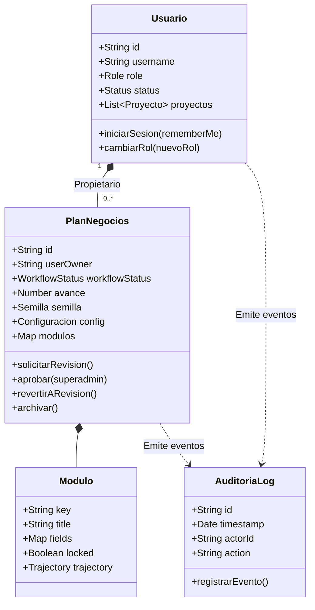

# DDD MASTER — Domain-Driven Design
**Proyecto:** Open Business Plan (Fondo Thoth AC)  

---

## 1. Lenguaje Ubicuo (Ubiquitous Language)

* **Plan de Negocios (Agregado Raíz):** Estructura viva que consolida la Semilla, la Configuración, los Pilares Académicos y los Módulos de Formulación.
* **Semilla (Entity):** Núcleo inicial de la idea de negocio estructurado en problema, solución, propuesta de valor, mercado objetivo y perfil del fundador.
* **Pilar (Bounded Context):** Agrupación conceptual de alto nivel (Estudio de Mercado, Ingeniería de Proyecto, Presupuesto CAPEX, Estructura de Capital, Riesgo Matemático).
* **Módulo (Entity):** Unidad atómica de redacción y cálculo (ej. Demanda, FODA, Balance General, TIR, Flujo de Efectivo).
* **CELIS Agentic Engine (Domain Service):** Motor autónomo ReAct que orquesta pensamientos, llamadas a herramientas, observaciones y reflexiones.
* **Trayectoria Cognitiva (Value Object / DeepSeek Harness):** Registro inmutable en formato DAG que captura cada paso de razonamiento, duración y herramientas utilizadas.
* **Herramienta Agéntica (Domain Tool):** Función ejecutable en vivo (`tool_web_search`, `tool_inegi_denue`, `tool_financial_engine`, `tool_quantum_diagnostic`, etc.).
* **Procedencia de Datos (Value Object):** Clasificación ontológica estricta del origen de un registro (`real`, `local_offline`, `synthetic`, `none`), con URL de origen y nivel de confianza.
* **Estado Honesto Vacío (Value Object):** Representación de ausencia de información factual en fuentes abiertas; prohíbe la invención de empresas o precios inexistentes.
* **Cuota Persistida (Value Object):** Contador mensual por proveedor (`YYYY-MM`) que regula el consumo de Fila 1 (Brave/Tavily) y bloquea cargos accidentales de Fila 2 sin autorización.
* **Inversión Canónica / CAPEX Canónico (Value Object):** Cifra monetaria raíz anclada a la semilla (`seed.inversion_esperada`) que rige como verdad matemática única para todos los estados financieros y métricas de rentabilidad.
* **Diagnóstico Cuántico Unificado (Domain Service):** Orquestador de evaluación del perfil del fundador (`runQuantumDiagnostic`) que analiza la distribución del átomo de 3 áreas y determina saltos cuánticos de escala.
* **Instantánea de Versión Inmutable (Aggregate Snapshot):** Captura física con hash SHA-1 y manifiesto (`.versions/`) que asegura que el progreso de redacción no sea sobreescrito ni degradado por sesiones paralelas.
* **Átomo de 3 Áreas (Value Object - Metodología Cuántica):** Tríada fundamental compuesta por Finanzas, Operaciones y Administración.
* **Fusión Atómica (Anti-patrón):** Anomalía donde el fundador concentra las 3 áreas simultáneamente, exigiendo plan de delegación obligatorio.
* **Usuario & Rol (Aggregate Root):** Identidad autenticada en el dominio (`superadmin`, `revisor`, `user`) con facultades RBAC y aislamiento multi-tenant.
* **Sesión Criptográfica (Value Object):** Token JWT transmitido exclusivamente mediante cookie segura HttpOnly `obp_auth_token` con política de retención dual (24 horas vs 30 días persistente con Recordarme).
* **Estado Editorial de Proyecto (Value Object):** Máquina de estados desacoplada del avance matemático (`Borrador` $\rightarrow$ `En revisión` $\rightarrow$ `Aprobado` $\rightarrow$ `Archivado`), con regla de invariancia que revierte un proyecto aprobado a revisión ante cualquier mutación.
* **Bitácora de Auditoría (Domain Event Stream):** Historial inmutable en disco (`server/data/audit_log.json`) que registra eventos de autenticación, escalación de privilegios, revisiones y exportaciones.
* **Dossier Canónico (Bounded Context de Presentación):** Representación editorial sincronizada al 100% entre Vista Previa web, exportación DOCX y renderizado a PDF en orientación vertical Letter (meta de 20–25 páginas ejecutivas).

---

## 2. Modelo de Agregados y Bounded Contexts

