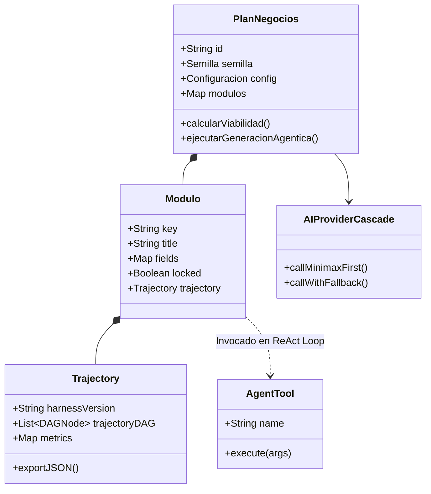

# DDD MASTER — Domain-Driven Design
**Proyecto:** Open Business Plan (Fondo Thoth AC)  

---

## 1. Lenguaje Ubicuo (Ubiquitous Language)

* **Plan de Negocios (Agregado Raíz):** Estructura viva que consolida la Semilla, la Configuración, los Pilares Académicos y los Módulos de Formulación.
* **Semilla (Entity):** Núcleo inicial de la idea de negocio estructurado en problema, solución, propuesta de valor, mercado objetivo y perfil del fundador.
* **Pilar (Bounded Context):** Agrupación conceptual de alto nivel (Estudio de Mercado, Ingeniería de Proyecto, Presupuesto CAPEX, Estructura de Capital, Riesgo Matemático).
* **Módulo (Entity):** Unidad atómica de redacción y cálculo (ej. Demanda, FODA, Balance General, TIR, Flujo de Efectivo).
* **CELIS Agentic Engine (Domain Service):** Motor autónomo ReAct que orquesta pensamientos, llamadas a herramientas, observaciones y reflexiones.
* **Trayectoria Cognitiva (Value Object / DeepSeek Harness):** Registro inmutable en formato DAG que captura cada paso de razonamiento, duración y herramientas utilizadas.
* **Herramienta Agéntica (Domain Tool):** Función ejecutable en vivo (`tool_web_search`, `tool_inegi_denue`, `tool_financial_engine`, `tool_quantum_diagnostic`, etc.).
* **Átomo de 3 Áreas (Value Object - Metodología Cuántica):** Tríada fundamental compuesta por Finanzas, Operaciones y Administración.
* **Fusión Atómica (Anti-patrón):** Anomalía donde el fundador concentra las 3 áreas simultáneamente, exigiendo plan de delegación obligatorio.

---

## 2. Modelo de Agregados y Bounded Contexts

