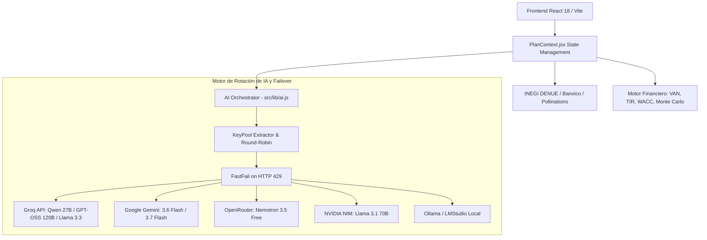

# SDD MASTER — Software Design Document & API Contracts
**Proyecto:** Open Business Plan (Fondo Thoth AC)  
**Versión:** 2.6.26.8.17  
**Estado:** Activo / Producción  

---

## 1. Arquitectura del Sistema

Open Business Plan implementa una arquitectura **Local-First con Resiliencia Cloud Híbrida y Orquestación Multi-Agente ("Mesa de Expertos")**.

---

## 2. Contratos de Funciones y Servicios de IA

### 2.1 `parseApiKeys(rawKey: string | string[]): string[]`
* **Entrada:** Cadena con una o múltiples llaves separadas por comas, saltos de línea o punto y coma.
* **Salida:** Array de strings limpios y validados.

### 2.2 `getRotatedApiKey(rawKey: string, providerName?: string): string`
* **Entrada:** Cadena de llaves y nombre de pool.
* **Salida:** Clave activa seleccionada mediante rotación circular Round-Robin.

### 2.3 `fetchWithRetry(url, options, { maxRetries, baseDelay, fastFailOn429 })`
* **Entrada:** URL, opciones de fetch y parámetros de control.
* **Salida:** Objeto `Response` o lanzamiento de excepción tipada `HTTP_429_RATE_LIMIT`.

### 2.4 `callAiProvider(config, prompt, expectJson, expectedKeys, onThink)`
* **Entrada:**
  * `config`: Configuración de proveedor y llaves (`provider`, `apiKey`, `groqKey`, `openrouterKey`, etc.).
  * `prompt`: Texto con instrucciones y contexto del negocio.
  * `expectJson`: Booleano para forzar parseo y sanitización JSON.
  * `expectedKeys`: Array de claves requeridas en el JSON de salida.
* **Salida:** Objeto parseado o texto plano.
* **Garantía:** Si el proveedor activo agota cuota (429), rota atómicamente al siguiente proveedor en vivo sin perder el estado de la fase.

---

## 3. Niveles de Profundidad de la Mesa de Expertos

| Nivel | Nombre | Fases / Agentes | Modelos Típicos | Tiempo Estimado |
| :--- | :--- | :--- | :--- | :--- |
| **1** | Rápido | 2 (Analista → Redactor) | Qwen 3.6 27B / Gemini Flash | 15 - 30 s |
| **2** | Pro | 3 (Analista → Crítico → Redactor) | Qwen 27B / GPT-OSS 120B | 1 - 2 min |
| **3** | Profundo | 5 (+ Estratega, Devil's Advocate) | Nemotron / Llama 3.3 70B | 3 - 6 min |
| **4** | Industrial | 9 (+ Operaciones, Finanzas, Coherencia, Anti-alucinación, Editor) | Cascade Multi-Proveedor | 5 - 10 min |
