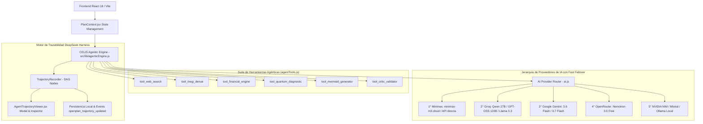

# SDD MASTER — Software Design Document & API Contracts
**Proyecto:** Open Business Plan (Fondo Thoth AC)  
**Versión:** 2.7.0 (Agéntico ReAct + DeepSeek Harness Trajectories)  
**Estado:** Activo / Producción  

---

## 1. Arquitectura del Sistema Agéntico ReAct & DeepSeek Harness

Open Business Plan implementa una arquitectura **Local-First con Resiliencia Cloud Híbrida, Agentes Autónomos ReAct y Trazabilidad Cognitiva DeepSeek Harness**.

---

## 2. Contratos de Funciones y Servicios de IA

### 2.1 `runAgenticModuleGeneration({ aiConfig, currentModule, planData, onStepUpdate, onLog })`
* **Entrada:** Configuración de IA, módulo a redactar, datos del plan, callbacks de actualización de pasos y logs.
* **Salida:** `{ result: Object, trajectory: Object (DeepSeek Harness v1.0) }`.
* **Garantía:** Ejecuta ciclo completo ReAct (Pensamiento ➔ Tool Call ➔ Observación ➔ Crítica ➔ Síntesis) persistiendo el DAG de ejecución en tiempo real.

### 2.2 `executeAgentTool(toolName, args)`
* **Entrada:** Nombre de herramienta (`tool_web_search`, `tool_financial_engine`, etc.) y parámetros JSON.
* **Salida:** `{ success: boolean, toolName: string, executionTimeMs: number, data: Object }`.

### 2.3 `TrajectoryRecorder(taskId, context)`
* **Métodos:**
  * `addStep(type, payload)`: Inserta nodo en el árbol DAG con `parentId`, `stepIndex`, `durationMs` y timestamp.
  * `finish(finalOutput, status)`: Sella la trayectoria con métricas acumuladas y estructura estándar `deepseek-harness-1.0`.

### 2.4 `callAiProvider(config, prompt, expectJson, expectedKeys, onThink)`
* **Entrada:** Configuración, prompt, parámetros JSON y callback de tokens de pensamiento.
* **Prioridad:** Minimax-M3 Cloud ➔ Groq ➔ Gemini Flash ➔ OpenRouter ➔ NVIDIA ➔ Ollama Local.

---

## 3. Niveles de Profundidad de la Mesa de Expertos

| Nivel | Nombre | Fases / Agentes | Modelos Típicos | Trazabilidad |
|---|---|---|---|---|
| **1 (⚡)** | Rápido | Analista ➔ Redactor | `minimax-m3:cloud` / Groq Qwen 27B | DAG 3 pasos (~15s) |
| **2 (🧠)** | Pro | Analista ➔ Crítico ➔ Tools ➔ Redactor | `minimax-m3:cloud` / GPT-OSS 120B | DAG 5-8 pasos (~45s) |
| **3 (🔬)** | Profundo | Mesa Completa (9 Agentes + 6 Tools) | Multi-Model Cascade | DAG 12-16 pasos (~120s) |
