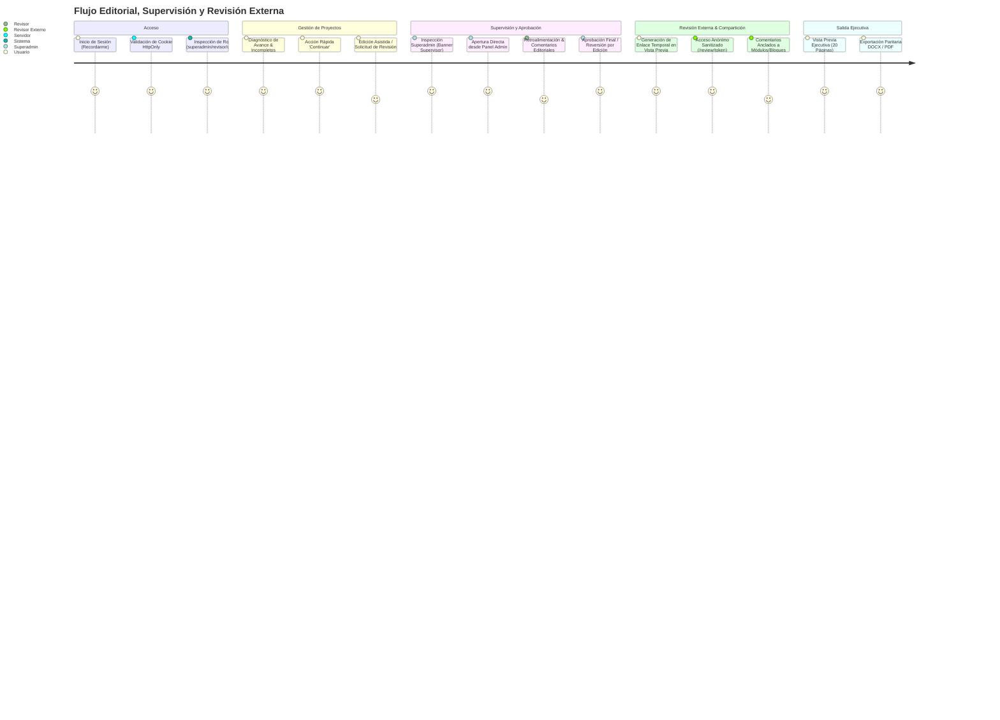

# UXDD MASTER — UX-Driven Development & User Journeys
**Proyecto:** Open Business Plan  

---

## 1. Principios de Experiencia de Usuario

* **Autenticación Silenciosa y Sesión Fricción-Cero:** El acceso se gestiona de forma transparente mediante cookies seguras `HttpOnly`. La opción "Recordarme" permite sesiones prolongadas de 30 días para usuarios recurrentes, o expiración automática al cerrar el navegador en equipos compartidos.
* **Supervisión Transparente sin Suplantación:** Los administradores que inspeccionan o asisten a usuarios nunca "suplantan" la identidad del propietario. Un banner superior fijo e informativo clarifica el modo de supervisión, manteniendo la autoría original y la confianza editorial.
* **Continuación Asistida de Proyectos Incompletos:** En lugar de presentar pantallas de error o requerir navegación manual, el gestor de proyectos identifica inmediatamente el primer módulo incompleto y ofrece un botón de acción rápida "Continuar" para llevar al usuario al punto exacto de trabajo pendiente.
* **Trazabilidad Cognitiva DeepSeek Harness:** Cada llamada a modelo o herramienta genera una traza visual navegable (DAG), permitiendo al usuario auditar el razonamiento, las fuentes consultadas y las decisiones del agente sin complejidad técnica.
* **Feedback Continuo y Transparente:** La generación con IA en segundo plano nunca congela la pantalla; siempre expone el Monitor flotante en vivo con el paso exacto y pestañas para alternar entre logs SSE y trayectorias.
* **Transparencia Radical de Procedencia (`ProvenanceBadge`):** Toda cifra, competidor y cotización exhibe su grado de veracidad mediante badges distintivos (🟢 Factual Verificado, 🟡 Hardware Local, 🔴 Estimación Sintética, ⚪ Sin Datos). Si un dato no se encuentra, el sistema no inventa; expone el estado honesto vacío para que el usuario conozca la limitación del mercado.
* **Dossier Ejecutivo de Alta Densidad y Elegancia Editorial:** La Vista Previa y las exportaciones a PDF/DOCX entregan un documento ejecutivo pulido de exactamente 20 páginas (máximo 25), en orientación vertical Letter estándar (`612 x 792 pts`), eliminando bloques de texto redundantes, notas al pie secundarias y tablas excesivas de 60 meses para favorecer la lectura de comités de inversión.
* **Estética Premium:** Paleta en modos claro/oscuro balanceados, tipografías sans-serif de alta legibilidad, efectos de glassmorphism y micro-interacciones suaves.
* **Revisión Externa Fricción-Cero:** Clientes, aliados e inversionistas externos acceden a una vista especializada (`ReviewPage`) con un solo clic en el enlace temporal recibido, sin necesidad de crear cuenta ni ingresar credenciales internas. El documento se presenta con formato editorial ejecutivo y anclaje de comentarios por módulo/bloque.

---

## 2. Mapa del Flujo de Usuario (User Journey)

