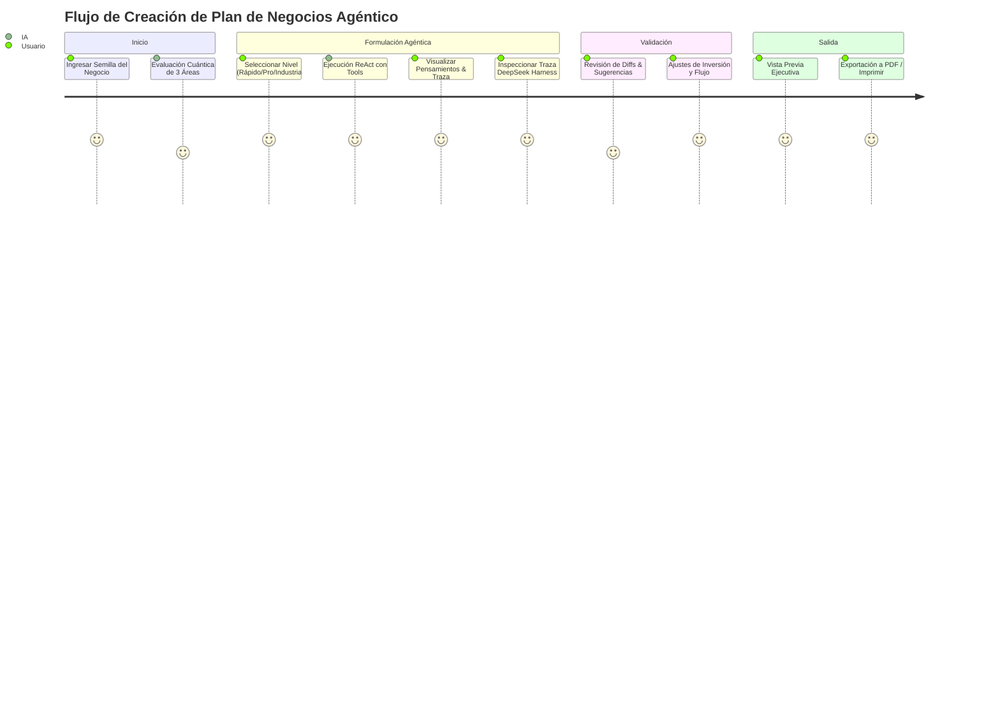

# UXDD MASTER — UX-Driven Development & User Journeys
**Proyecto:** Open Business Plan  

---

## 1. Principios de Experiencia de Usuario

* **Trazabilidad Cognitiva DeepSeek Harness:** Cada llamada a modelo o herramienta genera una traza visual navegable (DAG), permitiendo al usuario auditar el razonamiento, las fuentes consultadas y las decisiones del agente sin complejidad técnica.
* **Feedback Continuo y Transparente:** La generación con IA en segundo plano nunca congela la pantalla; siempre expone el Monitor flotante en vivo con el paso exacto (ej. `Fase 3/9: Analista de Operaciones`) y pestañas para alternar entre logs SSE y trayectorias.
* **Zero Interruption on Quotas:** Las saturaciones de cuotas de tokens (429) no alertan con modales de error que bloquean al usuario; se resuelven silenciosamente rotando de modelo o proveedor con Minimax-M3 como primera opción.
* **Control Humano (HITL):** En todo momento el usuario puede pausar, detener, editar directamente o revisar sugerencias mediante control de cambios (Diff visual).
* **Estética Premium:** Paleta en modos claro/oscuro balanceados, tipografías sans-serif de alta legibilidad, efectos de glassmorphism y micro-interacciones suaves.

---

## 2. Mapa del Flujo de Usuario (User Journey)

