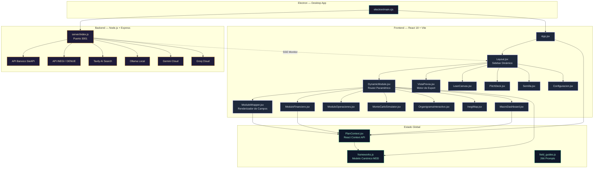
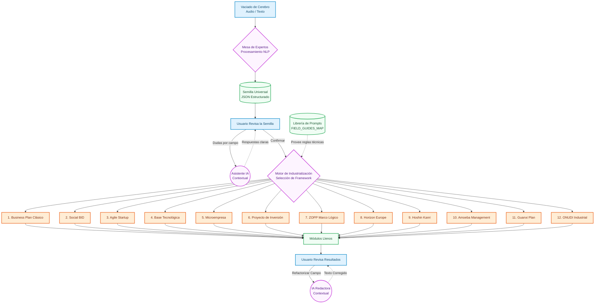
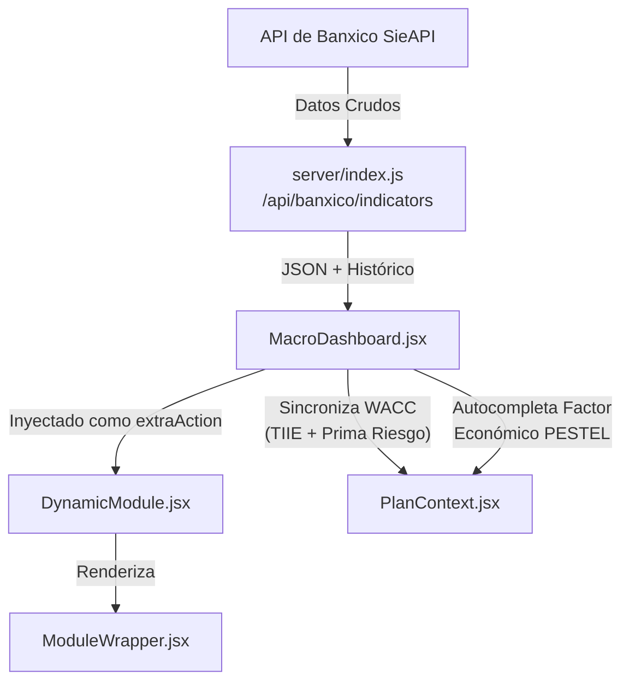

# Open Business Plan v3.0 — *MexiTaco Edition*


> Plataforma de Arquitectura de Negocios con IA Multi-Agente.  
> Genera planes de negocio completos usando **12 metodologías internacionales**, potenciada por una Mesa de Expertos IA, datos macroeconómicos en vivo y simulación probabilística Monte Carlo.

---

## 📋 Tabla de Contenidos

- [¿Qué hay de nuevo en v3.0?](#-qué-hay-de-nuevo-en-v30)
- [Arquitectura del Sistema](#-arquitectura-del-sistema)
- [Flujo de Datos](#-flujo-de-datos)
- [Los 12 Frameworks de Negocio](#-los-12-frameworks-de-negocio)
- [Inventario de Componentes](#-inventario-de-componentes)
- [Motor Financiero](#-motor-financiero)
- [APIs Externas Integradas](#-apis-externas-integradas)
- [Metodologías de Desarrollo](#-metodologías-de-desarrollo)
- [Instalación y Desarrollo](#-instalación-y-desarrollo)
- [Documentación Técnica](#-documentación-técnica)
- [Estado de Pruebas Frontend](#-estado-de-pruebas-frontend)
- [Roadmap](#-roadmap)

---

## 🚀 ¿Qué hay de nuevo en v3.0?

### Cambios Mayores (Breaking Changes)
| Categoría | v2.x | v3.0 |
|---|---|---|
| **Frameworks** | 1 método (Comercial) | **12 metodologías internacionales** |
| **Motor IA** | 1 modelo, 1 llamada | **Mesa de Expertos Multi-Agente** (3-5 agentes en cadena) |
| **Finanzas** | Corrida estática | **Simulador Monte Carlo** + corrida dinámica con Banxico en vivo |
| **Datos en Vivo** | Ninguno | **API Banxico** (Inflación, TIIE, Tipo de Cambio, UDIs) |
| **Organigrama** | Texto plano | **ReactFlow drag-and-drop** con layout automático |
| **Campos** | ~30 campos | **266 campos únicos** con prompts especializados |
| **Semilla** | No existía | **Anteproyecto + Semilla Universal** (vaciado de cerebro → industrialización) |
| **Mapa INEGI** | Básico | **Mapa de Calor + DENUE** interactivo con geolocalización |

### Nuevos Componentes (v3.0)
- 🎲 **MonteCarloSimulator.jsx** — Simulación estocástica de 10,000 iteraciones con histograma de viabilidad y cono de incertidumbre SVG.
- 📊 **MacroDashboard.jsx** — Dashboard macroeconómico con Sparklines SVG, datos de Banxico en tiempo real y sincronización directa al plan financiero.
- 🏗️ **OrganigramaInteractivo.jsx** — Organigrama drag-and-drop con ReactFlow, iconos lucide-react por rol y layout automático (dagre).
- 📝 **Anteproyecto.jsx** — Módulo de "vaciado de cerebro" que captura la idea del emprendedor y genera la Semilla Universal.
- 💹 **ModuloFinanciero.jsx** — Motor financiero completo con corrida a 5 años, VAN, TIR, punto de equilibrio e integración Banxico→WACC.
- ⚙️ **ModuloOperaciones.jsx** — KPIs operativos (OTD, DSO, CCC) con gauges animados y análisis IA.
- 🏢 **OrganizationFinanceToolkit.jsx** — Toolkit de finanzas organizacionales integrado.
- 📈 **FinancialCharts.jsx** — Gráficos financieros SVG avanzados (61KB de lógica de visualización).
- 🗺️ **InegiMap.jsx** — Mapa interactivo INEGI/DENUE con calor de competencia geoespacial.
- 🔍 **ExpertPanel.jsx** — Panel de la Mesa de Expertos con niveles de profundidad configurables.

### Mejoras de Infraestructura
- **Backend Industrial v2** (`server/index.js`) — Proxy para Banxico SieAPI, INEGI, DENUE, Tavily, con SSE para monitor de IA en tiempo real.
- **Motor de IA Multi-Proveedor** (`src/lib/ai.js`) — Soporta Ollama, Gemini, Groq, LM Studio y NVIDIA con fallback inteligente.
- **266 Prompts Especializados** (`src/lib/field_guides.js`) — Librería de instrucciones y ejemplos para cada campo de cada metodología.
- **Sistema de Temas** — CSS puro con variables dinámicas HSL para Light/Dark mode premium.

---

## 🏗 Arquitectura del Sistema



### Patrón de Diseño: Modular Orientado a Features

El proyecto **NO** usa Atomic Design estricto. En su lugar, implementa una arquitectura **Módulo-Componente** dinámica:

| Capa | Carpeta | Responsabilidad |
|---|---|---|
| **Módulos** | `src/modules/` | Vistas/Páginas completas del plan (10 archivos) |
| **Componentes** | `src/components/` | Widgets reutilizables e interactivos (34 archivos) |
| **Estado** | `src/context/` | PlanContext — estado global reactivo |
| **Config** | `src/config/` | Modelo canónico MDD (frameworks.js) |
| **Lógica** | `src/lib/` | Motor IA, finanzas, prompts, utilidades |
| **Server** | `server/` | Backend Express con proxy de APIs |

> **Principio clave:** Agregar un módulo nuevo es **puramente aditivo**. Solo necesitas declararlo en `frameworks.js` y aparece automáticamente en el sidebar, las rutas y el estado global.

---

## 🔄 Flujo de Datos

### Embudo de Industrialización (12 Metodologías)



### Flujo del Dashboard Macroeconómico



---

## 📚 Los 12 Frameworks de Negocio

| # | Framework | Módulos | Páginas | Enfoque |
|---|---|:---:|:---:|---|
| 1 | **Comercial (Clásico)** | 28 | 25–50 | Bancos e inversionistas tradicionales |
| 2 | **Social (BID / PM4R)** | 15 | 20–35 | ONGs, fondos de gobierno, impacto social |
| 3 | **Agile Startup (Lean)** | 8 | 8–15 | Software, capital semilla, pivoteo rápido |
| 4 | **Base Tecnológica (I+D)** | 8 | 15–25 | Patentes, spin-offs, laboratorios |
| 5 | **Microempresa** | 10 | 5–10 | Oficios, tiendas locales, créditos pequeños |
| 6 | **Proyecto de Inversión** | 10 | 40–80 | Corridas, factibilidad, bancos de desarrollo |
| 7 | **ZOPP (Marco Lógico)** | 4 | 15–25 | Cooperación internacional, evaluación social |
| 8 | **Horizon Europe** | 4 | 20–40 | I+D+i europeo, fondos Horizonte |
| 9 | **Hoshin Kanri** | 4 | 10–20 | Manufactura japonesa, despliegue estratégico |
| 10 | **Amoeba Management** | 4 | 10–15 | Células de rentabilidad japonesas |
| 11 | **Guanxi Plan** | 4 | 8–15 | Redes de relaciones comerciales China |
| 12 | **ONUDI Industrial** | 4 | 40–80 | Evaluación industrial global, Naciones Unidas |

> Todos los frameworks se declaran en `src/config/frameworks.js` (modelo canónico MDD).

---

## 🧩 Inventario de Componentes

### Módulos (`src/modules/` — 10 archivos)

| Archivo | Tamaño | Función |
|---|---|---|
| `VistaPrevia.jsx` | 113 KB | Motor de renderizado y exportación del plan completo |
| `Configuracion.jsx` | 73 KB | Panel de ajustes: IA, modelos, APIs, tema, exportación |
| `PitchDeck.jsx` | 19 KB | Generador de presentaciones para inversionistas |
| `Semilla.jsx` | 18 KB | Entrevista fundacional + vaciado de cerebro |
| `LeanCanvas.jsx` | 6 KB | Lienzo Lean Canvas interactivo |
| `Finanzas.jsx` | 4 KB | Punto de entrada al módulo financiero |
| `Anexos.jsx` | 4 KB | Gestión de documentos adjuntos |
| `Canvas.jsx` | 3 KB | Business Model Canvas |
| `Mercado.jsx` | 3 KB | Análisis de mercado |
| `Foda.jsx` | 2 KB | Matriz FODA interactiva |

### Componentes (`src/components/` — 34 archivos)

| Archivo | Tamaño | Función |
|---|---|---|
| `FinancialCharts.jsx` | 62 KB | Gráficos SVG financieros avanzados |
| `InegiMap.jsx` | 55 KB | Mapa interactivo INEGI/DENUE |
| `MonteCarloSimulator.jsx` | 35 KB | Simulación estocástica con histograma y cono |
| `Layout.jsx` | 34 KB | Sidebar + navegación + controles de generación |
| `ModuloFinanciero.jsx` | 29 KB | Corrida financiera + VAN/TIR + Banxico sync |
| `ModuleWrapper.jsx` | 24 KB | Renderizador dinámico de campos con Mermaid |
| `ModuloOperaciones.jsx` | 22 KB | KPIs operativos + gauges animados |
| `OrganizationFinanceToolkit.jsx` | 21 KB | Toolkit financiero organizacional |
| `MacroDashboard.jsx` | 20 KB | Dashboard Banxico con Sparklines SVG |
| `ExpertPanel.jsx` | 19 KB | Panel Mesa de Expertos IA (3 niveles) |
| `Anteproyecto.jsx` | 18 KB | Vaciado de cerebro → Semilla |
| `SetupWizard.jsx` | 17 KB | Wizard de primera ejecución |
| `ActivityFeed.jsx` | 13 KB | Feed de actividad del monitor IA |
| `MermaidViewer.jsx` | 13 KB | Renderizador de diagramas Mermaid |
| `BusinessModelCanvas.jsx` | 11 KB | Canvas de modelo de negocios |
| `FlowDiagramViewer.jsx` | 10 KB | Visor de diagramas de flujo (ReactFlow) |
| `DynamicModule.jsx` | 11 KB | Router dinámico de módulos |
| `PresupuestoEmpresa.jsx` | 9 KB | Presupuesto empresarial |
| `StaffTable.jsx` | 9 KB | Tabla de personal |
| `OrganigramaInteractivo.jsx` | 7 KB | Organigrama drag-and-drop (ReactFlow) |
| `HubspotBuyerPersona.jsx` | 7 KB | Mapa de empatía del Buyer Persona |
| `ProcessTable.jsx` | 7 KB | Tabla de procesos operativos |
| `TamSamSom.jsx` | 6 KB | Visualización TAM/SAM/SOM |
| `DocumentUploader.jsx` | 6 KB | Carga de documentos PDF/DOCX |
| `PdfOcrReader.jsx` | 6 KB | Lector OCR de PDFs (Tesseract.js) |
| `PestelAnalysis.jsx` | 6 KB | Análisis PESTEL con factores |
| `FodaMatrix.jsx` | 5 KB | Matriz FODA visual |
| `ModuleField.jsx` | 5 KB | Campo de formulario individual |
| `GenerationControls.jsx` | 4 KB | Controles de generación IA |
| `FieldComments.jsx` | 3 KB | Comentarios por campo |
| `HeatmapEditor.jsx` | 2 KB | Editor de mapas de calor |
| `SimuladorModal.jsx` | 2 KB | Modal del simulador |
| `DiffViewer.jsx` | 2 KB | Visor de diferencias de texto |
| `ErrorBoundary.jsx` | 1 KB | Capturador de errores React |

### Librerías (`src/lib/` — 11 archivos)

| Archivo | Función |
|---|---|
| `ai.js` (47 KB) | Motor IA multi-proveedor con Mesa de Expertos |
| `field_guides.js` (54 KB) | 266 prompts especializados por campo y metodología |
| `projects_db.js` (72 KB) | Base de datos de proyectos ejemplo |
| `apiManager.js` (3 KB) | Gestor de conexiones API |
| `inegi.js` (2 KB) | Cliente API INEGI |
| `finanzas/calculadoraFinanciera.js` (8 KB) | Motor de cálculos financieros |
| `finanzas/corrida-cibercafe.js` (23 KB) | Ejemplo de corrida financiera |
| `finanzas/financial-calculations.ts` (24 KB) | Cálculos financieros TypeScript |
| `finanzas/montecarlo.js` (6 KB) | Motor estocástico Monte Carlo |
| `finanzas/salarios.js` (6 KB) | Base de datos de salarios |
| `finanzas/types.ts` (5 KB) | Tipos TypeScript financieros |

---

## 💹 Motor Financiero

### Simulador Monte Carlo
- **10,000 iteraciones** estocásticas por simulación
- Variables de entrada: inversión, ingresos, costos fijos/variables, inflación, volatilidad
- Salida: VAN estocástico (P10, P50, P90), probabilidad de éxito, histograma bicolor, cono de incertidumbre temporal
- Integración directa con datos de Banxico para tasas reales

### Corrida Financiera
- Proyección a **5 años** con inflación dinámica
- **VAN** (Valor Actual Neto) y **TIR** (Tasa Interna de Retorno)
- **Punto de Equilibrio** calculado automáticamente
- **WACC** = TIIE (Banxico en vivo) + Prima de Riesgo configurable

### Fórmulas de KPIs Operativos
```
OTD  = (Pedidos a Tiempo / Total Pedidos) × 100
DSO  = (Cuentas por Cobrar / Ventas Anuales) × 365
DPO  = (Cuentas por Pagar / COGS) × 365
CCC  = DIO + DSO − DPO
```

---

## 🌐 APIs Externas Integradas

| API | Proveedor | Endpoint Proxy | Datos |
|---|---|---|---|
| **SieAPI** | Banco de México | `/api/banxico/indicators` | Inflación, TIIE, Tipo de Cambio, UDIs |
| **DENUE** | INEGI | `/api/denue/search` | Establecimientos económicos geolocalizados |
| **INEGI** | INEGI | Interno | Municipios, códigos postales |
| **Tavily** | Tavily AI | `/api/search` | Investigación web con IA |
| **Ollama** | Local | `localhost:11434` | LLMs locales (Gemma, Qwen, Phi) |
| **Gemini** | Google | API Cloud | Modelo cloud de respaldo |
| **Groq** | Groq Inc. | API Cloud | Inferencia ultra-rápida |

Cada API tiene ruta de prueba en: `/api/test/{banxico|inegi|tavily}`

---

## 🧠 Metodologías de Desarrollo

El proyecto emplea **9 metodologías** documentadas con etiquetas en código:

| Etiqueta | Metodología | Archivo Clave |
|---|---|---|
| `[TDD]` | Test-Driven Development | `src/lib/ai.js` |
| `[BDD]` | Behavior-Driven Development | `src/components/SetupWizard.jsx` |
| `[SDD]` | Solution-Driven Development | `docs/Operations_Integration_SDD.md` |
| `[DDD]` | Domain-Driven Design | `src/context/PlanContext.jsx` |
| `[FDD]` | Feature-Driven Development | Lista de features en docs |
| `[EDD]` | Event-Driven Development | `src/context/PlanContext.jsx` |
| `[MDD]` | Model-Driven Development | `src/config/frameworks.js` |
| `[HDD]` | Hypothesis-Driven Development | Hipótesis en docs |
| `[RDD]` | README-Driven Development | Este archivo |

> Documentación completa: [`docs/METODOLOGIAS_DESARROLLO.md`](docs/METODOLOGIAS_DESARROLLO.md)

---

## 🛠️ Instalación y Desarrollo

### Requisitos Previos
- **Node.js** ≥ 18.x
- **npm** ≥ 9.x
- (Opcional) **Ollama** para IA local

### Inicio Rápido
```bash
# 1. Instalar dependencias
npm install

# 2. Iniciar servidor + frontend simultáneamente
npm start

# 3. O iniciar por separado:
npm run server   # Backend en http://localhost:3001
npm run dev      # Frontend en http://localhost:5173
```

### Modo Electron (Desktop)
```bash
# Desarrollo
npm run electron:dev

# Build para distribución
npm run electron:build
```

### Estructura de Carpetas
```
open-business-plan-v3/
├── docs/                    # Documentación técnica (SDD, TDD, BDD)
├── electron/                # Configuración Electron
├── public/                  # Assets estáticos
├── server/                  # Backend Node.js + Express
│   └── index.js             # Servidor principal (792 líneas)
├── src/
│   ├── App.jsx              # Punto de entrada React
│   ├── main.jsx             # Bootstrap
│   ├── index.css            # Sistema de diseño CSS puro
│   ├── components/          # 34 componentes React
│   ├── config/
│   │   └── frameworks.js    # Modelo canónico (12 frameworks, 266 campos)
│   ├── context/
│   │   └── PlanContext.jsx   # Estado global (702 líneas)
│   ├── lib/                 # Motor IA + finanzas + prompts
│   │   ├── ai.js            # Motor IA Multi-Agente
│   │   ├── field_guides.js  # Librería de 266 prompts
│   │   └── finanzas/        # Calculadora + Monte Carlo + salarios
│   ├── modules/             # 10 módulos/vistas
│   └── utils/               # Utilidades
├── package.json             # Dependencias y scripts
├── vite.config.js           # Configuración Vite
└── README.md                # Este archivo
```

---

## 📁 Documentación Técnica

| Documento | Descripción |
|---|---|
| [`docs/SDD.md`](docs/SDD.md) | Software Design Document — Arquitectura general |
| [`docs/TDD.md`](docs/TDD.md) | Estrategia de pruebas y validación |
| [`docs/BDD.md`](docs/BDD.md) | Escenarios de usuario en formato Gherkin |
| [`docs/Operations_Integration_SDD.md`](docs/Operations_Integration_SDD.md) | SDD del módulo de operaciones y KPIs |
| [`docs/METODOLOGIAS_DESARROLLO.md`](docs/METODOLOGIAS_DESARROLLO.md) | Guía completa de las 9 metodologías de desarrollo |
| [`docs/DIAGRAMA_FLUJO_METODOS.md`](docs/DIAGRAMA_FLUJO_METODOS.md) | Diagrama Mermaid del embudo de industrialización |
| [`docs/MATRIZ_MODULOS.md`](docs/MATRIZ_MODULOS.md) | Matriz cruzada de módulos × frameworks |
| [`docs/COMPARATIVA_METODOS.md`](docs/COMPARATIVA_METODOS.md) | Comparativa detallada de los 5 primeros métodos |

---

## ✅ Estado de Pruebas Frontend

> Última actualización: 2026-06-15

| Componente / Función | Estado | Notas |
|---|---|---|
| Sidebar dinámico (Layout.jsx) | ✅ Funciona | Genera menú automático desde frameworks.js |
| Navegación entre módulos | ✅ Funciona | Rutas paramétricas `/modulo/:pillar/:module` |
| Botón "Bloque/Módulo" | 🔲 Pendiente | Falta verificar interacción de bloqueo |
| Monte Carlo Simulator | ✅ Funciona | Histograma y cono de incertidumbre renderizan correctamente |
| Dashboard Banxico (PESTEL) | ✅ Funciona | Sparklines SVG, sincronización exitosa |
| Sincronizar Finanzas del Plan | ✅ Funciona | WACC = TIIE + 2% inyectado correctamente |
| Redactar Análisis Económico | ✅ Funciona | Autocompletado del factor económico PESTEL |
| Organigrama Interactivo | ✅ Funciona | ReactFlow drag-and-drop con dagre |
| Mapa INEGI/DENUE | ✅ Funciona | Mapa de calor con geolocalización |
| SetupWizard | ✅ Funciona | Detección de hardware y modelos |
| Tema Light/Dark | ✅ Funciona | Switch sin recarga |
| Vista Previa / Exportación | 🔲 Pendiente | Falta verificar renderizado completo PDF |
| Lean Canvas | ✅ Funciona | Canvas interactivo editable |
| Pitch Deck | ✅ Funciona | Slides generados y editables |
| Mesa de Expertos (3 niveles) | ✅ Funciona | Analista → Crítico → Redactor |
| Corrida Financiera 5 años | ✅ Funciona | VAN, TIR, Punto de Equilibrio |

---

## 🗺️ Roadmap

### v3.1 — Próximas Tareas
- [ ] **F07**: Exportación PDF con branding corporativo
- [ ] **F08**: Integración DENUE/INEGI en tiempo real (producción)
- [ ] **F09**: Colaboración multi-usuario
- [ ] Pruebas E2E automatizadas (Playwright)
- [ ] Migrar tipos TypeScript a todo el proyecto
- [ ] Internacionalización (i18n) — Inglés, Portugués
- [ ] App móvil con React Native

### v4.0 — Visión Futura
- [ ] WACC automatizado con Yahoo Finance / FRED
- [ ] Tablas de amortización dinámicas (SOFR, TIIE)
- [ ] Integración NewsAPI / GDELT para escaneo de tendencias
- [ ] World Bank Open Data API para riesgo país
- [ ] Multi-tenancy con Firebase Auth

---

## 📊 Métricas del Proyecto

| Métrica | Valor |
|---|---|
| **Total de archivos fuente** | ~55 (JSX/JS/TS/CSS) |
| **Tamaño del código fuente** | ~750 KB |
| **Componentes React** | 34 |
| **Módulos/Vistas** | 10 |
| **Frameworks de negocio** | 12 |
| **Campos únicos** | 266 |
| **Dependencias de producción** | 13 |
| **APIs externas integradas** | 7 |

---

*Desarrollado con ❤️ para **FondoThothAC** — Versión 3.0 (Junio 2026)*
