# 🗺️ Open Business Plan (OpenPlan) — Diagrama Maestro de Arquitectura y Flujos en yEd

> **Formulación e Industrialización de Planes de Negocio con IA Multi-Agente & Metodología Empresas Cuánticas (Fondo Thoth AC)**  
> Archivo nativo en formato **GraphML** diseñado para ser visualizado, editado y analizado en **yEd Graph Editor**, **Draw.io**, **Cytoscape** y navegadores web.

---

## 📁 Archivos Generados en la Carpeta `diagrams/`

1. 📄 [**`OpenBusinessPlan_Master_Architecture.graphml`**](file:///Users/robertoeduardocelisrobles/Documents/Proyectos/Open-Business-Plan/diagrams/OpenBusinessPlan_Master_Architecture.graphml):
   - Archivo nativo estándar de **yEd Graph Editor**.
   - **Métricas:** `61 nodos` organizados en 11 clusters temáticos y `67 aristas` dirigidas con etiquetas de flujo.
   - Totalmente estilizado con paleta moderna dark executive, bordes neón diferenciados y fuentes legibles.
2. 📄 [**`OpenBusinessPlan_Master_Architecture.graphml.xml`**](file:///Users/robertoeduardocelisrobles/Documents/Proyectos/Open-Business-Plan/diagrams/OpenBusinessPlan_Master_Architecture.graphml.xml):
   - Respaldo idéntico con doble extensión para compatibilidad con visores XML y herramientas de grafos que exigen terminación `.xml`.
3. 🎨 [**`OpenBusinessPlan_Master_Architecture.svg`**](file:///Users/robertoeduardocelisrobles/Documents/Proyectos/Open-Business-Plan/diagrams/OpenBusinessPlan_Master_Architecture.svg):
   - Render vectorial de alta fidelidad con rejilla cyber y acentos neón para previsualizar en cualquier navegador (Chrome, Safari, Firefox).
4. ⚙️ [**`scripts/generate_openplan_graphml.py`**](file:///Users/robertoeduardocelisrobles/Documents/Proyectos/Open-Business-Plan/scripts/generate_openplan_graphml.py):
   - Script generador reproducible que permite actualizar el grafo en caso de adición de nuevos módulos o frameworks.

---

## 🎨 Código de Colores y Clusters Visuales en yEd

| Cluster Temático | Color de Fondo en yEd | Borde de Acento Neón | Archivos de Código Vinculados |
| :--- | :---: | :---: | :--- |
| **Cabecera & Core del Sistema** | Obsidiana (`#0A0D18`) | Cian Neón (`#00F3FF`) | `src/App.jsx`, `SetupWizard.jsx`, `server/index.js` |
| **Entrada & Semilla Universal** | Azul Medianoche (`#1E293B`) | Celeste (`#38BDF8` / `#10B981`) | `Anteproyecto.jsx`, `AdaptiveSeedForm.jsx`, `DualInputSyncHub.jsx` |
| **Empresas Cuánticas (Fondo Thoth AC)** | Púrpura Imperial (`#2E1065`) | Violeta Neón (`#C084FC` / `#F43F5E`) | `QuantumProfileCard.jsx`, `.agents/skills/empresas-cuanticas/` |
| **Mesa de Expertos Multi-Agente** | Índigo Profundo (`#1E1B4B`) | Fucsia (`#C084FC` / `#F59E0B`) | `src/lib/ai.js`, `ExpertPanel.jsx`, `GlobalTokenMonitor.jsx` |
| **12 Métodos de Industrialización** | Verde Teal Oscuro (`#042F2E`) | Esmeralda (`#2DD4BF` / `#5EEAD4`) | `src/config/frameworks.js`, `docs/MATRIZ_MODULOS.md` |
| **Hub de Inteligencia de Mercado** | Océano Oscuro (`#0F2847`) | Azul Cielo (`#38BDF8`) | `InegiMap.jsx`, `AnalisisCompetenciaGoogle.jsx`, `TamSamSom.jsx` |
| **Hub Técnico & Operaciones** | Cobre / Tierra (`#431407`) | Naranja Neón (`#FB923C`) | `ModuloOperaciones.jsx`, `FloorPlanDiagram.jsx`, `ProcessTable.jsx` |
| **Motor Financiero & Monte Carlo** | Esmeralda Oscuro (`#064E3B`) | Verde Menta (`#34D399` / `#10B981`) | `calculadoraFinanciera.js`, `ModuloFinanciero.jsx`, `MonteCarloSimulator.jsx` |
| **Organización, Talento & Gobernanza** | Azul Cobalto (`#1E1B4B`) | Lavanda (`#818CF8`) | `OrganigramaInteractivo.jsx`, `HumanCapitalMatrix.jsx`, `RACIMatrix.jsx` |
| **Persistencia & Exportación** | Grafito / Carbón (`#18181B`) | Oro / Ámbar (`#FACC15`) | `PlanContext.jsx`, `proyectos/`, `WordDocumentCenterModal.jsx` |
| **Bob Concierge AI & Herramientas** | Vino Borgoña (`#4C0519`) | Rosa Neón (`#FB7185`) | `BobChatModal.jsx`, `TouchBarBridge.jsx`, `git_sync.sh` |

---

## 🏛️ Mapa Visual Completo de Arquitectura (Mermaid)

```mermaid
graph TD
    %% CABECERA & HARDWARE
    Logo["🚀 Open Business Plan (OpenPlan) • Master Architecture<br/>Industrialization Engine • Fondo Thoth AC"]
    Init["⚙️ Inicialización & Detección Hardware<br/>(GPU, VRAM, Ollama Local Serve, Electron Bridge)"]
    Wizard{"¿Primera Ejecución?<br/>SetupWizard"}
    Users["👥 Matriz de Usuarios & Aislamiento Local<br/>Super-Users (admin/roberto) & Proyectos /negocios y /social"]

    Logo --> Init
    Init --> Wizard
    Wizard --> Users
    Init --> Users

    %% FASE 1: ENTRADA & SEMILLA
    Dump["🎤 Vaciado de Cerebro (Entrada Libre)<br/>Audio Whisper • Texto Libre • OCR de PDFs"]
    NLP["🧠 Mesa de Extracción NLP<br/>Semilla Universal (6 Pilares)"]
    SeedForm["🌱 AdaptiveSeedForm<br/>Validación Campo por Campo con IA Contextual"]
    DualSync["🔄 DualInputSyncHub<br/>Sincronización Bidireccional Prompt Libre ↔ Campos"]

    Users --> Dump
    Dump --> NLP --> SeedForm
    Dump <--> DualSync <--> SeedForm

    %% METODOLOGÍA EMPRESAS CUÁNTICAS
    subgraph "⚛️ Metodología Propietaria: Empresas Cuánticas (Fondo Thoth AC)"
        Q_Head["⚛️ Capa Transversal Empresas Cuánticas"]
        Q_Prof["👤 QuantumProfileCard: Diagnóstico Inicial del Fundador"]
        Q_Atom["🔬 Modelo Atómico de 3 Áreas: Finanzas • Operativo • Administrativo"]
        Q_Nuc{"⚠️ Principio Nuclear: Máx 1 o 2 Áreas<br/>(Prohibido operar las 3)"}
        Q_Del["🤝 Delegación Estructurada: Vacantes & Salarios de Mercado"]
        Q_Leap["📈 Saltos Cuánticos de Escala (1-5, 5-20, multi-sucursal)"]
        Q_Ind["🕊️ Principio de Independencia: Ruta de Autonomía Operativa"]
        Q_Anti["🚫 Detección de 4 Anti-Patrones: Solo jefe / Invertir / Rápido / Fusión"]

        Q_Head --> Q_Prof --> Q_Atom --> Q_Nuc
        Q_Nuc --> Q_Del --> Q_Leap --> Q_Ind
        Q_Nuc --> Q_Anti
    end

    SeedForm --> Q_Head

    %% MESA DE EXPERTOS & ORQUESTADOR IA
    Orch["🎼 Orquestador Multi-Agente (src/lib/ai.js & server/index.js)"]
    Depth["🎚️ 4 Niveles de Profundidad (N1 Rápido a N4 Industrial)"]
    Fallback["🔀 Cascada Inteligente Fallback: Ollama Local ➔ NIM ➔ Groq/Gemini/OpenAI"]
    Telem["📡 Telemetría, Streaming SSE & Reintentos HTTP 429 con Backoff"]

    SeedForm --> Orch
    Orch --> Depth
    Orch --> Fallback
    Orch --> Telem

    %% EMBUDO DE INDUSTRIALIZACIÓN (12 MÉTODOS)
    IndEngine["🏭 Motor de Industrialización (FIELD_GUIDES_MAP)"]
    Depth --> IndEngine

    M1["1. Plan Comercial Clásico"]
    M2["2. Social BID / PM4R"]
    M3["3. Agile Startup (Lean MVP)"]
    M4["4. Base Tecnológica I+D"]
    M5["5. Microempresa & Autoempleo"]
    M6["6. Proyecto de Inversión"]
    M7["7. ZOPP / Marco Lógico"]
    M8["8. Horizon Europe (UE)"]
    M9["9. Hoshin Kanri (Japón)"]
    M10["10. Amoeba (Kyocera)"]
    M11["11. Guanxi (China)"]
    M12["12. Factibilidad ONUDI"]

    IndEngine --> M1 & M2 & M3 & M4 & M5 & M6 & M7 & M8 & M9 & M10 & M11 & M12

    %% HUBS ESPECIALIZADOS
    subgraph "🗺️ Hub de Mercado & Territorialidad"
        H_Mkt["Hub de Mercado"]
        DENUE["📍 Scraping DENUE / INEGI (InegiMap.jsx)"]
        Places["🔍 Scraping Google / Places / UberEats"]
        TAM["📊 Calculadora TAM • SAM • SOM"]
        PESTEL["🧭 Matrices Estratégicas FODA / PESTEL"]
        H_Mkt --> DENUE & Places & TAM & PESTEL
    end

    subgraph "⚙️ Hub Técnico, Operaciones & Planta"
        H_Ops["Hub Técnico & Operaciones"]
        Layout["📐 Lay-out de Planta (FloorPlanDiagram.jsx)"]
        Flow["⏱️ Diagrama de Procesos & Cuellos de Botella TOC"]
        RFQ["🏭 Cotizador de Maquinaria (MachineryRfqModal.jsx)"]
        KPI_Ops["📦 Métricas Operativas (OTD, Rotación, DSO, CCC)"]
        H_Ops --> Layout & Flow & RFQ & KPI_Ops
    end

    subgraph "💰 Motor Financiero & Simulación Estocástica"
        H_Fin["Motor Financiero (calculadoraFinanciera.js)"]
        NIF["📑 Estados Financieros NIF B-2/B-3/B-6 (5 Años)"]
        PE["⚖️ Punto de Equilibrio & Margen de Contribución"]
        KPI_Fin["📈 Indicadores VPN, TIR, Payback, B/C"]
        MonteCarlo["🎲 Simulador Monte Carlo (10,000 Iteraciones, VaR)"]
        Reserve["🛡️ Multi-Escenario & Reserva Laboral LFT"]
        H_Fin --> NIF & PE & KPI_Fin --> MonteCarlo & Reserve
    end

    subgraph "👥 Hub de Organización, Talento & Gobernanza"
        H_Org["Hub de Organización"]
        OrgChart["👔 Organigrama Interactivo Jerárquico"]
        Salarios["💵 Matriz de Capital Humano & IMSS/INFONAVIT"]
        RACI["🎯 Matriz RACI & Hoshin Kanri X-Matrix"]
        Amoeba["🦠 Estructura Celular Amoeba (Micro-ganancias)"]
        H_Org --> OrgChart & Salarios & RACI & Amoeba
    end

    M1 --> H_Mkt & H_Ops & H_Fin & H_Org
    Q_Del -.-> H_Org
    Q_Atom -.-> H_Fin

    %% PERSISTENCIA & EXPORTACIÓN
    PlanCtx["💎 PlanContext.jsx (Single Source of Truth)"]
    FS["💾 Persistencia Local (proyectos/ .json + .md)"]
    DocCenter["📄 Centro de Exportación (Word .docx, PDF, Markdown)"]
    Diff["🔍 DiffReviewModal (Control de Cambios con IA)"]

    H_Mkt & H_Ops & H_Fin & H_Org --> PlanCtx
    PlanCtx --> FS & DocCenter & Diff

    %% BOB BOT & HERRAMIENTAS
    Bob["🤖 Bob Concierge AI (BobChatModal.jsx)"]
    Touch["⌨️ TouchBar & Hardware Shortcuts"]
    Sync["🔄 Git Sync Proactivo (./git_sync.sh)"]

    Logo -.-> Bob --> Touch & Sync
```

---

## 🚀 ¿Cómo Abrir y Explorar el Diagrama en yEd Graph Editor?

Como **yEd** está instalado y ejecutándose en tu Mac:

1. En **yEd Graph Editor**, ve al menú:
   `File` ➔ `Open...` (o atajo `Cmd + O`).
2. Navega a la ruta:
   `/Users/robertoeduardocelisrobles/Documents/Proyectos/Open-Business-Plan/diagrams/OpenBusinessPlan_Master_Architecture.graphml`
3. **Disposición Automática de yEd (Recomendado):**
   - Para ver la jerarquía de arriba a abajo: pulsa `Layout` ➔ `Hierarchical...` (orientación *Top to Bottom*).
   - Para ver la distribución orgánica por agrupaciones: pulsa `Layout` ➔ `Organic...`.
   - Para ajustar el grafo al tamaño de la ventana: pulsa el icono de la **Lupa con marco** o el atajo `Cmd + 0` (*Fit Content*).
4. **Navegación Interactiva:**
   - Haz zoom con la rueda del ratón o el trackpad.
   - Selecciona cualquier nodo para ver sus propiedades, textos completos y enlaces dirigidos.
