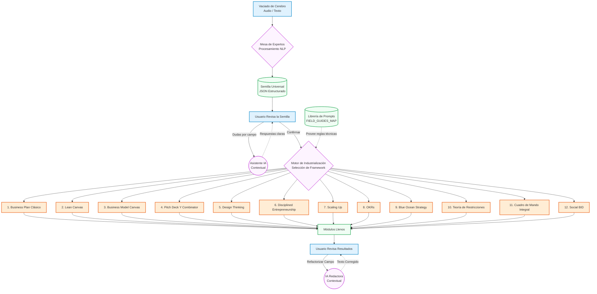

# Diagrama de Flujo: Embudo de Industrialización (12 Metodologías)

Este diagrama ilustra cómo el sistema transforma la idea pura del usuario (Vaciado de cerebro) en la **Semilla Universal**, y cómo esta a su vez es utilizada por el motor de IA para autocompletar e "industrializar" los campos específicos de cualquiera de los 12 métodos estratégicos disponibles.

### Explicación del Flujo paso a paso:

1. **Vaciado de Cerebro (Entrada):** El flujo siempre arranca desde el `Anteproyecto.jsx` donde el usuario narra de forma desestructurada su idea.
2. **Procesamiento NLP (IA):** El agente extrae los 6 pilares de la idea y forma la `Semilla Universal`.
3. **Revisión Asistida:** El usuario confirma la semilla, pidiendo ayuda a un sub-agente IA por campo si no entiende un concepto.
4. **Motor de Industrialización:** Cuando el usuario decide iniciar la generación, el motor toma:
   - Los datos de la **Semilla Universal** (De qué trata el negocio).
   - Las reglas técnicas de la **Metodología Seleccionada** (Desde `FIELD_GUIDES_MAP`).
5. **Generación Específica (Los 12 Métodos):** La Mesa de Expertos (formada por el Analista, Crítico y Redactor) usa esos dos insumos para redactar todos los campos del método seleccionado utilizando la jerga correcta (ej. "early adopters" para Lean Canvas, "actividades clave" para Business Model Canvas, etc.).
6. **Revisión y Refactorización Final:** El usuario entra al módulo renderizado y revisa el texto extenso. Si algo no le gusta, usa el botón "Re-escribir con instrucciones" y el texto se actualiza de forma automática.
