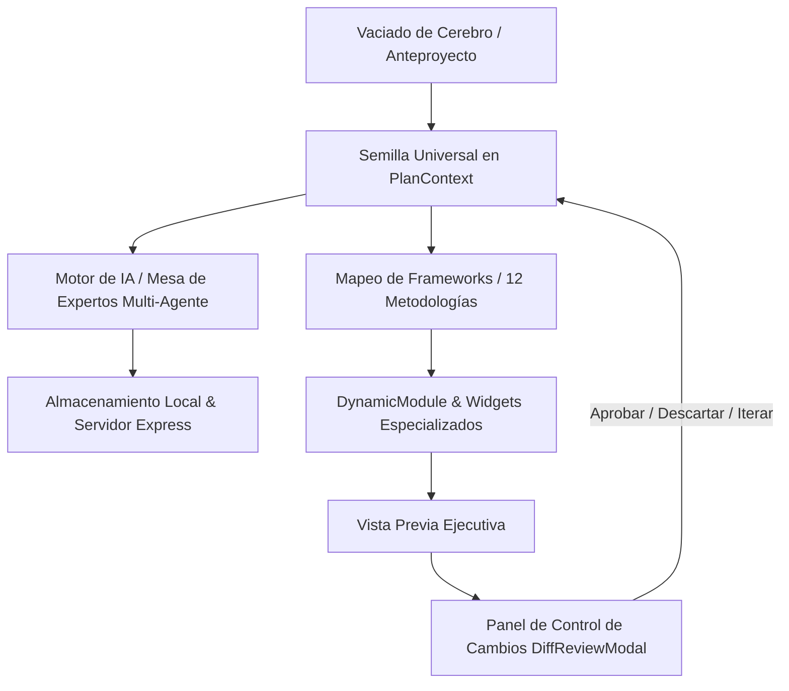

# Software Design Document (SDD) - Open Business Plan v2.7

## 1. Introducción y Propósito
Este documento define la arquitectura y el diseño técnico del sistema de formulación e industrialización de planes de negocio **Open Business Plan (OpenPlan)**. Define la arquitectura del **Panel de Control de Cambios con Diff Interactivo** y los **Widgets Visuales Especializados** para las 12 metodologías soportadas.

---

## 2. Arquitectura Global del Sistema

### Componentes Clave:
1. **`PlanContext.jsx`**: Estado centralizado reactivo con doble capa de persistencia (`localStorage` y API REST hacia `proyectos/`).
2. **`DiffReviewModal.jsx`**: Modal interactivo de control de versiones en tiempo real que compara el texto actual contra la propuesta de la IA mediante el algoritmo de diferencias por palabras de `diff`.
3. **Widgets Visuales de Metodologías**:
   - `ArbolProblemasObjetivos.jsx`: Visualizador de causalidad para Social BID y ZOPP.
   - `XMatrixHoshinKanri.jsx`: Matriz X de alineación estratégica para Hoshin Kanri.
   - `AmoebaStructureViewer.jsx`: Estructura de células operativas para Amoeba Management.
4. **`VistaPrevia.jsx`**: Renderizador optimizado para impresión ejecutiva con paginación híbrida y protección de tablas.

---

## 3. Especificación del Sistema de Control de Cambios (Diff Engine)

### 3.1. Flujo de Retroalimentación y Refactorización
1. **Captura de Notas**: El usuario ingresa comentarios en `FieldComments` asociados a una clave `pilar.modulo.campo`.
2. **Generación Asíncrona**: Al pulsar "Re-escribir con IA", se invoca `refactorFieldWithComments(aiConfig, { fieldLabel, currentValue, comments, planData })`.
3. **Revisión en `DiffReviewModal`**:
   - En lugar de sobreescribir el campo de forma silenciosa, se levanta el modal presentando:
     - Comparativa en paralelo o unificada (inserciones en verde `<ins>`, eliminaciones en rojo `<del>`).
     - Metadatos del campo e historial de comentarios aplicados.
     - Campo de texto para retroalimentación adicional en caso de desear otra iteración con la IA.
4. **Decisión del Usuario**:
   - **Aceptar**: Actualiza el campo en `PlanContext` mediante `updateSection(pillar, module, field, newText)` y limpia los comentarios procesados.
   - **Descartar**: Cierra el modal conservando el valor original intacto.
   - **Re-instruir / Iterar**: Envía una nueva solicitud al agente con la retroalimentación adicional.

---

## 4. Especificación de los Widgets Especializados

### 4.1. Árbol de Problemas y Objetivos (`ArbolProblemasObjetivos.jsx`)
- **Propósito**: Mapear relaciones de causa-efecto (Problema Central, Causas Raíz, Efectos) y su transformación en medios-fines (Objetivo Central, Medios, Fines).
- **Entradas**: Texto o JSON estructurado de los módulos `arbol_problemas` y `arbol_objetivos` del BID y ZOPP.
- **Salida Visual**: Tarjetas interactivas por niveles (Causas / Problema / Efectos) y diagrama Mermaid jerárquico.

### 4.2. Matriz X de Hoshin Kanri (`XMatrixHoshinKanri.jsx`)
- **Propósito**: Alinear los 4 cuadrantes estratégicos de la metodología Hoshin Kanri:
  - *Sur*: Objetivos Estratégicos a Largo Plazo (3-5 años).
  - *Oeste*: Metas Tácticas Anuales.
  - *Norte*: Prioridades y Proyectos de Mejora.
  - *Este*: Métricas Clave (KPIs) y Responsables.
- **Salida Visual**: Tabla matricial interactiva con indicadores de correlación (● Fuerte, ○ Moderada).

### 4.3. Estructura Celular de Amoeba Management (`AmoebaStructureViewer.jsx`)
- **Propósito**: Visualizar la subdivisión de la empresa en micro-unidades de negocio autónomas ("Amebas"), mostrando su balance de ingresos, gastos y cálculo de valor añadido por hora-hombre.

---

## 5. Criterios de Compatibilidad y Exportación
- Todos los widgets deben contar con un renderizado amigable para impresión (`@media print`) y generar versiones legibles en la exportación a Markdown y PDF.
