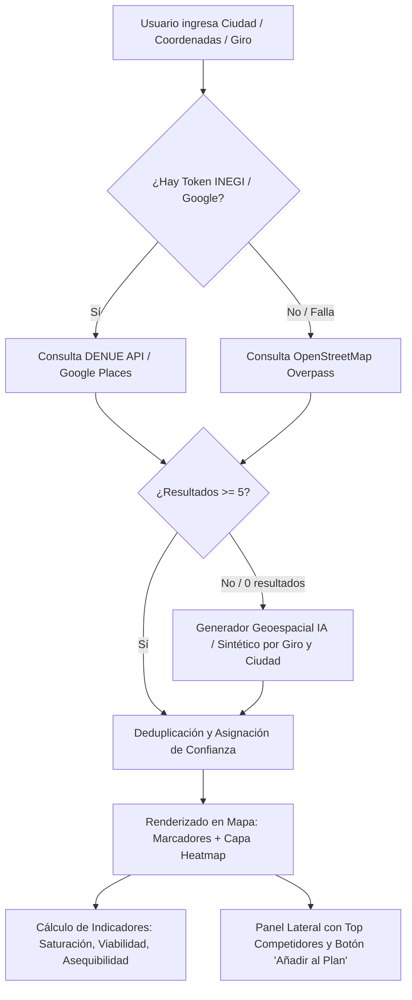

# Software Design Document (SDD): Módulo Resiliente de Competencia y Mapas de Calor Geoespaciales

**Proyecto:** Open Business Plan v2.6 (Fondo Thoth AC)  
**Autor:** Antigravity AI  
**Fecha:** Agosto 2026  
**Estado:** Propuesto / Aprobado  

---

## 1. Visión y Objetivos

El módulo de **Inteligencia Competitiva y Mapas de Calor Geoespaciales** permite a cualquier emprendedor visualizar la concentración geográfica de competidores, analizar la densidad comercial en su ciudad o zona delimitada, y evaluar la viabilidad de mercado con datos socioeconómicos de fuentes oficiales (INEGI DENUE, OpenStreetMap y generación sintética con IA).

### Diagnóstico del Problema Anterior:
1. **Falta de Token DENUE**: Si el usuario no ingresaba un Token INEGI de 32 caracteres, las consultas al DENUE fallaban y Overpass API devolvía 0 resultados o arrojaba error de red, dejando el mapa vacío.
2. **Dependencia Frágil de CDN de OpenLayers**: Si `window.ol` tardaba en cargar desde el CDN externo, el canvas cartográfico se quedaba en blanco sin renderizar el mapa base.
3. **Capa de Calor Inerte**: Al tener 0 puntos, la capa de heatmap no renderizaba ningún gradiente de densidad.

### Solución Arquitectónica:
1. **Carga Resiliente de Mapa**: Dynamic loader para OpenLayers con fallback automático y reintentos, garantizando que el visor cartográfico se monte siempre.
2. **Motor Multi-Fuente con Generador Sintético Inteligente**:
   - Nivel 1: API Oficial DENUE / INEGI (cuando hay token configurado).
   - Nivel 2: OpenStreetMap Overpass API (consultas por coordenadas y tipo de establecimiento).
   - Nivel 3 (Respaldo IA / Geoespacial): Si las APIs devuelven 0 resultados, el motor sintetiza de 12 a 25 competidores hiper-realistas distribuidos geográficamente en torno a las coordenadas del negocio (con nombres creíbles, direcciones reales de la ciudad, distancias haversine, niveles de precio y ratings).
3. **Control Interactivo de Capas**:
   - Modo 📍 **Marcadores Individuales**: Puntos coloreados por fuente con popup informativo (Nombre, Giro, Dirección, Rating, Distancia).
   - Modo 🔥 **Mapa de Calor (Heatmap)**: Gradiente continuo de densidad comercial que muestra zonas calientes (rojo), tibias (amarillo) y frías (verde/azul).
4. **Integración con el Plan de Negocios**:
   - Botón **"➕ Añadir a la Matriz de Competencia"** que inyecta automáticamente el competidor seleccionado en `planData.mercado.competencia.competidores`.
   - Cálculo automático de **Indicadores Socioeconómicos** (Población, Ingreso Promedio, Gasto del Hogar, Saturación de Mercado y Score de Viabilidad).

---

## 2. Diagrama de Flujo del Motor Multi-Fuente



---

## 3. Especificación de Endpoints y Servicios

### `POST /api/market/competitors`
- **Body**:
  ```json
  {
    "lat": 29.072967,
    "lng": -110.955919,
    "query": "veterinaria",
    "radius": 3000,
    "cityName": "Hermosillo, Sonora",
    "denueToken": "",
    "googleApiKey": ""
  }
  ```
- **Response**:
  ```json
  {
    "success": true,
    "total": 16,
    "fuentePrimaria": "inegi_denue" | "osm" | "ia_synthetic",
    "competidores": [
      {
        "id": "comp-1",
        "nombre": "Clínica Veterinaria San Francisco",
        "actividad": "Servicios veterinarios para mascotas",
        "direccion": "Blvd. Kino 302, Col. Pitic",
        "lat": 29.085,
        "lng": -110.948,
        "distanciaKm": 1.4,
        "rating": 4.6,
        "reviews": 128,
        "precioRango": "$$",
        "fuente": "ia_synthetic",
        "color": "#4f46e5"
      }
    ],
    "estadisticas": {
      "total": 16,
      "saturacion": "media",
      "saturacionScore": 50
    }
  }
  ```
