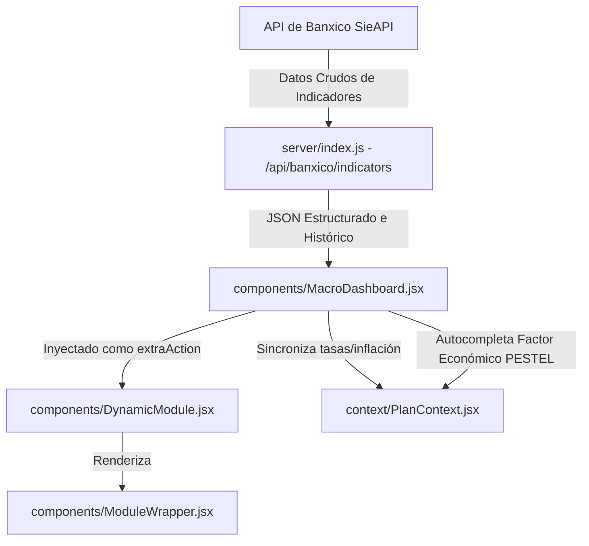

# SDD / BDD / TDD - Componente 2: Dashboards Macroeconómicos en Vivo (API Banxico)

Este documento detalla el diseño de software (SDD), comportamiento (BDD) y plan de pruebas (TDD) para el desarrollo del **Dashboard Macroeconómico en Vivo** integrado con la API de Banxico (SieAPI).

---

## 1. SDD (Software Design Document)

El dashboard macroeconómico consultará indicadores en tiempo real mediante un proxy en el backend Node/Express para eludir problemas de CORS e inyectará de forma modular la información directamente en el estudio del entorno PESTEL (Económico) asistiendo al usuario en el pronóstico financiero del plan.

### Flujo de Datos del Dashboard

### Modificaciones en Archivos Existentes

#### 1. [MODIFY] [server/index.js](file:///Users/robertoeduardocelisrobles/Documents/FT%20Apps/open-business-plan-v2.5.12.3/server/index.js)
Añadiremos un nuevo endpoint proxy GET `/api/banxico/indicators` que:
- Consulte la API de Banxico SieAPI para los últimos 6 meses de datos históricos oportunos de las siguientes series:
  - **Inflación (INPC):** `SP74625`
  - **Tasa de Interés de Referencia (TIIE 28d):** `SF43783`
  - **Tipo de Cambio FIX (USD/MXN):** `SF43718`
  - **UDIs (Unidades de Inversión):** `SP68257`
- Mapee los resultados en una estructura con la última cotización y la tendencia de los últimos 6 meses (para graficar sparklines).
- Si la llamada falla o no hay conexión a internet, devuelva datos estables de respaldo (mock data) marcando la bandera `isFallback: true` y la fecha de última actualización simulada.

#### 2. [NEW] [MacroDashboard.jsx](file:///Users/robertoeduardocelisrobles/Documents/FT%20Apps/open-business-plan-v2.5.12.3/src/components/MacroDashboard.jsx)
Un componente React interactivo y premium que contendrá:
- **Tarjetas de Indicadores (Glassmorphism):**
  - **Inflación Anual (INPC %):** Con tarjeta verde/ámbar/roja según el nivel de estabilidad.
  - **Tasa de Interés (TIIE %):** Con un gráfico de cuadrante tipo velocímetro simplificado en SVG.
  - **Tipo de Cambio (USD/MXN):** Paridad actual en vivo.
  - **UDIs:** Valor actual del indicador.
- **Sparklines SVG Dinámicas:** Mini gráficas lineales fluidas y sutilmente animadas que muestren la tendencia de los últimos 6 meses para cada indicador.
- **Acciones Rápidas del Entorno:**
  - **"Aplicar Inflación al Plan":** Sincroniza la inflación reportada por Banxico con la inflación de costos proyectados en el `PlanContext`.
  - **"Utilizar TIIE como WACC Base":** Actualiza el costo de descuento financiero básico con el nivel de interés en vivo.
  - **"Escribir Análisis en PESTEL":** Un asistente que redacta de forma automática el análisis económico del entorno del plan usando la información en vivo y el giro del negocio.

#### 3. [MODIFY] [DynamicModule.jsx](file:///Users/robertoeduardocelisrobles/Documents/FT%20Apps/open-business-plan-v2.5.12.3/src/components/DynamicModule.jsx)
Modificaremos el componente para inyectar `<MacroDashboard />` en la propiedad `extraAction` del `ModuleWrapper` cuando la ruta activa sea la del módulo PESTEL (`pillarId === 'naturaleza' && moduleId === 'pestel'`).

---

## 2. BDD (Behavior Driven Development)

### Escenario 1: Visualización en tiempo real de indicadores
- **Given** que el usuario está editando el módulo PESTEL de su plan de negocios.
- **When** se renderiza la pantalla del módulo PESTEL.
- **Then** el sistema invoca de forma asíncrona el proxy `/api/banxico/indicators` enviando el token de Banxico configurado.
- **And** despliega el Dashboard Macroeconómico al final de la pantalla con las 4 tarjetas de indicadores.
- **And** dibuja una sparkline SVG con la tendencia alcista o bajista de la inflación y tasas del último semestre.

### Escenario 2: Sincronización e impacto financiero
- **Given** que los indicadores macroeconómicos muestran una tasa TIIE de 11.25%.
- **When** el usuario hace clic en el botón "Sincronizar Parámetros Financieros".
- **Then** el sistema actualiza de forma global los valores de inflación esperada y tasa de descuento en el módulo financiero del plan de negocios.
- **And** recalcula las proyecciones automáticamente ofreciendo feedback de éxito.

---

## 3. TDD (Test Driven Development)

### Casos de Prueba del Proxy Backend (`server/index.js`)
1. **Respuesta Correcta de la API:**
   - **Prueba:** Invocar GET `http://localhost:3001/api/banxico/indicators` con un token válido.
   - **Aceptación:** Retorna código 200 con un JSON que contiene `inflacion`, `tiie`, `tipoCambio`, `udis` con valor, fecha y un array de al menos 6 puntos históricos de tendencia.
2. **Resiliencia ante Caídas (Fallback):**
   - **Prueba:** Invocar el endpoint sin conexión a internet o con un token alterado de forma deliberada.
   - **Aceptación:** Retorna código 200 con la bandera `isFallback: true` y un set de datos coherentes para evitar que la UI se bloquee.

### Casos de Prueba de la UI (`MacroDashboard.jsx`)
1. **Renderizado de Sparklines:**
   - **Prueba:** Cargar el componente con una serie vacía de datos de tendencia.
   - **Aceptación:** El gráfico SVG debe dibujar un guion o mensaje y no fallar por llamadas a funciones matemáticas con arrays vacíos.
2. **Actualización de Contexto:**
   - **Prueba:** Presionar el botón "Aplicar Inflación" e inspeccionar el estado de `planData.organizacion.estados_financieros.inflationRate` o `planData.config.inflationRate`.
   - **Aceptación:** El valor del plan debe ser actualizado de forma reactiva con el porcentaje exacto reportado por Banxico.

---

## User Review Required

> [!IMPORTANT]
> **Integración del Análisis Económico en PESTEL**
> El dashboard macroeconómico asiste en el llenado de la sección **PESTEL -> Económico**. Proponemos añadir un botón dentro del Dashboard llamado **"Escribir Análisis en PESTEL"** que autocompleta el cuadro de texto del factor económico del plan con un formato estructurado como:
> *"Entorno económico actual en México (Actualizado al [Fecha]): Inflación anual en [Valor]%, Tasa de Interés TIIE de [Valor]% y tipo de cambio FIX a $[Valor] MXN/USD. Estos indicadores repercuten en el giro del negocio..."*
> 
> ¿Te parece adecuado que autocomplete el factor Económico con esta estructura detallada o prefieres que la IA redacte un párrafo libre más conversacional?
