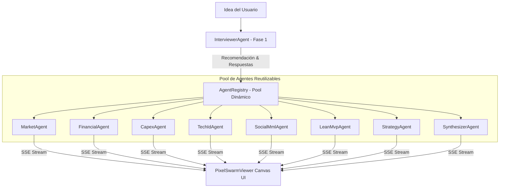

# Documento de Diseño de Software (SDD v2.0): Motor Multi-Agente Swarm Engine & Pixel Swarm Office

**Proyecto:** Open Business Plan  
**Versión:** 2.6.26.7.24  
**Estado:** Especificación Aprobada para Implementación  

---

## 1. Visión General del Sistema

El **Swarm Engine v2.0** extiende la capacidad de IA de Open Business Plan a través de un **Pool Dinámico de Agentes Reutilizables (`AgentRegistry.js`)** y un flujo conversacional de dos fases:

1. **Fase 1: Diagnóstico y Entrevista Contextual (`InterviewerAgent.js`):**
   El sistema analiza la idea inicial del usuario, realiza 2 a 3 preguntas de precisión para clarificar ambigüedades y **recomienda el tipo de documento/framework ideal** entre los 11 frameworks disponibles en la plataforma (`business`, `social_bid`, `agile_startup`, `technology_id`, `investment_project`, `zopp`, `horizon_europe`, `hoshin_kanri`, `amoeba_management`, `guanxi_plan`, `onudi_project`).

2. **Fase 2: Orquestación del Enjambre Especializado (`SwarmOrchestrator.js`):**
   El servidor Express asigna y ejecuta concurrentemente el subconjunto específico de agentes especialistas según el documento seleccionado, transmitiendo progresos en tiempo real mediante SSE a la interfaz visual gamificada **Pixel Swarm Office** (`PixelSwarmViewer.jsx`).

---

## 2. Catálogo de Agentes Reutilizables

---

## 3. Matriz de Agentes por Tipo de Documento

| Framework / Documento | Agentes Activos |
| :--- | :--- |
| **Plan Comercial (`business`)** | `market`, `financial`, `strategy`, `synthesizer` |
| **Proyecto Social BID (`social_bid`)** | `social_mml`, `strategy`, `synthesizer` |
| **Agile Startup (`agile_startup`)** | `lean_mvp`, `market`, `financial`, `synthesizer` |
| **Innovación / I+D (`technology_id`)** | `tech_id`, `market`, `financial`, `synthesizer` |
| **Proyecto de Inversión (`investment_project`)** | `capex_wacc`, `market`, `financial`, `synthesizer` |
| **Estudio ONUDI (`onudi_project`)** | `capex_wacc`, `market`, `strategy`, `synthesizer` |
| **ZOPP Marco Lógico (`zopp`)** | `social_mml`, `strategy`, `synthesizer` |

---

## 4. Estrategia de Implementación
- **Garantía de Código Completo (Regla Estricta):** Todos los archivos de agente, controladores Express y componentes React se construirán sin fragmentación, garantizando llaves de cierre y firmas completas.
- **Sincronización:** Ejecución del build local `npm run build` y `./git_sync.sh` al finalizar.
