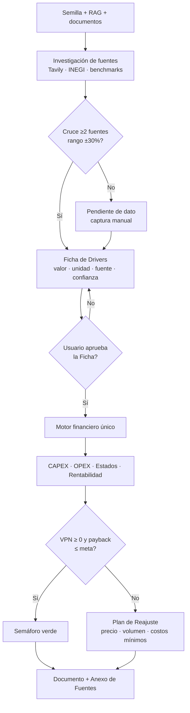

# Plan v3 — Saneamiento financiero: proceso de creación + código

## Goal Description
Los proyectos pequeños daban millones o negativos porque el flujo **inventa datos** (fallback de galletas, tope de CAPEX en \$1M, ventas por defecto de \$50k) en lugar de usar la Semilla, el RAG y fuentes reales. Este plan corrige **tres capas**: captura de datos, motor de cálculo y presentación honesta del resultado.

## Decisiones acordadas (grill-me)

| # | Decisión | Resultado |
|---|---|---|
| D1 | Datos faltantes | **Cero cifras inventadas.** Se estima con Tavily/INEGI/benchmarks/bases de datos, cruzando fuentes. Las fuentes se listan al final del documento. |
| D2 | Umbral de confianza | **Mínimo 2 fuentes reales cruzadas (±30%)**. Si no se logra: `Pendiente de dato` y el usuario captura o aprueba el valor. |
| D3 | Ficha de Drivers | **Obligatoria.** Datos estructurados con unidad, fuente y confianza; el usuario la aprueba **antes** de calcular. |
| D4 | Inviabilidad | **Mostrar el resultado real** con semáforo de viabilidad. Se eliminan los topes cosméticos (TIR 48.5%, ROI 180%). |
| D5 | Plan de Reajuste | **Módulo nuevo:** valores de precio, volumen y costos a los que hay que operar para recuperar la inversión. Meta configurable en **meses**. |
| D6 | Casos de oro | **CCI, VCV, Closets Corona + Galletas** (`user_ragv/galletas_de_semillas_saludables`) + Cibercafé FAPPA + 2 sintéticos. |

## Arquitectura objetivo

## Fases y pasos

### Fase 0 — Especificaciones y pruebas (antes de tocar código)
1. Generar documentos de metodología exigidos por tus reglas en `docs/architecture/`: SDD, TDD, BDD (escenarios Dado/Cuando/Entonces), ATDD, DDD, SLI/SLO/SLA del cálculo financiero.
2. Crear los **casos de oro** como fixtures en `tests/fixtures/` con cifras esperadas:
   - CCI: CAPEX \$20M, fijos \$285k/mes, TIR ≈ 15.11%.
   - VCV: \$4M, 5,184 kg/mes, \$963/kg, costo \$610/kg, equilibrio 781.87 kg.
   - Closets Corona: CAPEX \$150k (\$80k enchapadora + \$25k aislamiento + \$45k melamina), luz \$6k + gasolina \$7k.
   - Galletas: debe reproducir su semilla real, no el valor fijo.
   - Cibercafé FAPPA: corrida importada intacta.
   - 2 sintéticos: servicio sin insumos y comercio pequeño.
3. Escribir los tests en rojo (TDD): ningún resultado contiene "galletas" fuera del proyecto de galletas; CAPEX respeta la semilla; payback nunca es un número absurdo.

**Criterio de salida:** tests fallan por las razones correctas y documentos aprobados.

### Fase 1 — Dominio: Ficha de Drivers Financieros (DDD/MDD)
Archivos nuevos (sin dependencia de React):
- `src/lib/finanzas/driversSchema.js`: esquema de la Ficha. Cada driver: `{ valor, unidad: 'mensual'|'anual'|'unitario'|'total', fuentes: [], confianza: 'alta'|'media'|'pendiente', estado: 'pendiente'|'aprobado' }`.
  Drivers: precio/ticket, volumen/mes, costo variable unitario, costos fijos/mes, CAPEX desglosado, capital de trabajo, horizonte, tasa de descuento, anticipos/cobranza.
- `src/lib/finanzas/driversExtractor.js`: construye la Ficha desde Semilla, RAG (`project_evidence`) y `INDUSTRY_BENCHMARKS`, **sin inventar**.
- `src/lib/finanzas/crossValidation.js`: cruza ≥2 fuentes y valida rango ±30%; normaliza mensual/anual.

**Criterio de salida:** extractor produce Fichas correctas para los 5 casos de oro; los faltantes quedan `pendiente`.

### Fase 2 — Investigación con fuentes reales (EDD)
1. `driversResearch.js`: para cada driver `pendiente`, consulta Tavily/INEGI/DENUE/benchmarks y emite eventos de progreso (SSE) a la consola del cliente.
2. Reutiliza `tool_deep_research` (ya trae `provenance`) con `allowSyntheticEstimate: false`.
3. Registra cada fuente con URL, fecha de consulta, cifra extraída y nivel de procedencia.
4. Si no hay 2 fuentes que coincidan: `Pendiente de dato`.

**Criterio de salida:** ninguna cifra entra a la Ficha sin ≥2 fuentes o aprobación manual.

### Fase 3 — Motor de cálculo único (ADD)
Modificar [`calculadoraFinanciera.js`](file:///Users/robertoeduardocelisrobles/Documents/Proyectos/OBP/src/lib/finanzas/calculadoraFinanciera.js):
1. **Eliminar** el fallback de galletas (líneas ~354-413), el tope `Math.min(1000000, …)` (línea 314) y los valores por defecto 1200 pzas / \$18 / \$3,000.
2. Que `parseToProjectData()` consuma **solo la Ficha aprobada**. Sin Ficha: devolver `No calculable` (la rama ya existe, línea 463).
3. **Quitar topes cosméticos**: TIR 48.5%, ROI 180%, payback `|| 1`.
4. **Payback/TIR honestos:** si no recupera → `No recuperable en N meses`; si flujos todos negativos → `TIR no definida`.
5. **Unificar motores:** `tool_financial_engine` (agentTools.js, defaults 50k/25k) y `ModuloFinanciero.jsx` pasan a usar el mismo motor y la misma Ficha.
6. Corregir el IRR/NPV para consistencia entre `agentTools` y `financial-calculations.ts`.

**Criterio de salida:** casos de oro en verde; cero apariciones de galletas fuera de su proyecto.

### Fase 4 — Plan de Reajuste (módulo nuevo)
- Nuevo módulo `organizacion/reajuste` en `frameworks.js`, `moduleBoxMap.js` y generación en `PlanContext.jsx`.
- `src/lib/finanzas/reajusteSolver.js`: búsqueda de raíz (bisección) sobre el VPN para resolver:
  - **Precio mínimo** para VPN ≥ 0 y payback ≤ meta.
  - **Volumen mínimo** mensual.
  - **Costo fijo máximo** tolerable.
  - **Combinación realista** (ej. +10% precio y +15% volumen).
- **Meta configurable en meses** (por defecto: VPN ≥ 0 a WACC y payback ≤ 36 meses).
- Contrasta el precio mínimo contra precios reales de competencia obtenidos de las fuentes (si el precio requerido supera el mercado, lo advierte).
- Salida en español: tabla "Operar a / Hoy estás en / Brecha".

**Criterio de salida:** para un caso inviable, el solver devuelve valores que, al reinyectarse al motor, dan VPN ≈ 0.

### Fase 5 — Interfaz y flujo de creación (UXDD/PDD)
1. **Paso nuevo en la Semilla/Anteproyecto:** "Ficha de Drivers" con tabla editable, semáforo de confianza por fila, botón "Investigar fuentes" y "Aprobar Ficha".
2. Bloquear la generación de los 5 módulos financieros mientras la Ficha esté `pendiente` (con mensaje claro de qué falta).
3. Barra de progreso y consola de logs durante la investigación.
4. En `ModuloFinanciero.jsx`: semáforo de viabilidad y panel del Plan de Reajuste con meta ajustable.
5. Textos en español neutro premium.

### Fase 6 — Anexo de Fuentes en el documento
- Sección final automática **"Fuentes y Procedencia de Datos"** en `VistaPrevia.jsx` y en la exportación Word/PDF: cifra, valor, fuentes, fecha, confianza.
- Las cifras aprobadas manualmente se marcan "Aportado por el emprendedor".

### Fase 7 — Validación y despliegue
1. `npm test` (hoy 353/353 en verde; no debe haber regresión).
2. `npm run build`.
3. Prueba end-to-end en vivo: generamos juntos un plan nuevo y anotas qué falla (tu flujo de ajuste iterativo).
4. `./git_sync.sh "Saneamiento financiero: Ficha de Drivers, fuentes cruzadas y Plan de Reajuste"`.

## SLI / SLO / SLA del cálculo financiero
| Indicador | SLO |
|---|---|
| Cifras con ≥2 fuentes o aprobación manual | 100% |
| Apariciones de datos de otro proyecto | 0 |
| Consistencia entre motores (VPN) | diferencia < 0.5% |
| Tiempo de cálculo por corrida | < 500 ms |
| Tests de casos de oro | 100% en verde |

## Riesgos
> [!WARNING]
> Sin APIs (Tavily/INEGI) disponibles, muchas Fichas quedarán en `Pendiente de dato`. Es el comportamiento correcto, pero obliga a capturar datos manualmente.

> [!IMPORTANT]
> Los proyectos ya guardados pueden tener cifras viejas contaminadas con galletas. Propongo un script de **auditoría de solo lectura** que los marque, sin modificarlos.

## Open Questions
> [!NOTE]
> Quedan por decidir (las resolveremos en el siguiente tramo del grill-me): **(a)** si la auditoría de proyectos existentes se hace en esta entrega, **(b)** qué APIs de precios usar además de Tavily/INEGI y si hay presupuesto de llamadas pagadas, **(c)** alcance en otros frameworks (social BID, agile).

## Verification Plan
- **Automatizado:** `npx tsx --test tests/financialDrivers.test.js tests/reajusteSolver.test.js tests/goldenProjects.test.js` y `npm test` + `npm run build`.
- **Manual:** crear un proyecto nuevo contigo, revisar la Ficha, aprobarla, y verificar estados financieros, semáforo, Plan de Reajuste y Anexo de Fuentes.
